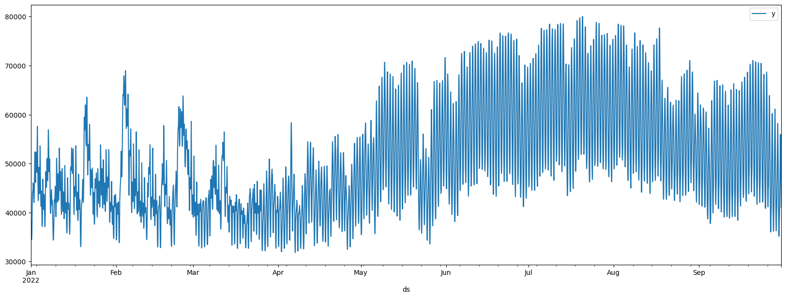
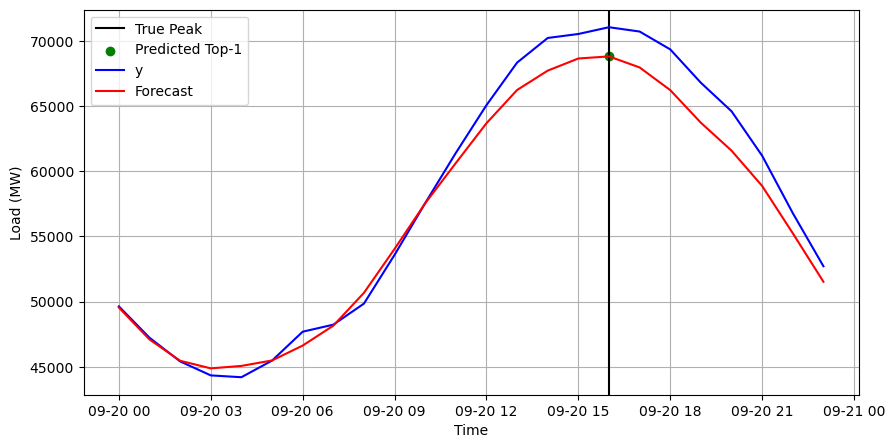

export const quartoRawHtml =
[`<div>
<style scoped>
    .dataframe tbody tr th:only-of-type {
        vertical-align: middle;
    }
    .dataframe tbody tr th {
        vertical-align: top;
    }
    .dataframe thead th {
        text-align: right;
    }
</style>
`,`
</div>`];

> In this example we will show how to perform electricity load
> forecasting on the ERCOT (Texas) market for detecting daily peaks.

## Introduction {#introduction}

Predicting peaks in different markets is useful. In the electricity
market, consuming electricity at peak demand is penalized with higher
tarifs. When an individual or company consumes electricity when its most
demanded, regulators calls that a coincident peak (CP).

In the Texas electricity market (ERCOT), the peak is the monthly
15-minute interval when the ERCOT Grid is at a point of highest
capacity. The peak is caused by all consumers’ combined demand on the
electrical grid. The coincident peak demand is an important factor used
by ERCOT to determine final electricity consumption bills. ERCOT
registers the CP demand of each client for 4 months, between June and
September, and uses this to adjust electricity prices. Clients can
therefore save on electricity bills by reducing the coincident peak
demand.

In this example we will train an `NHITS` model on historic load data to
forecast day-ahead peaks on September 2022. Multiple seasonality is
traditionally present in low sampled electricity data. Demand exhibits
daily and weekly seasonality, with clear patterns for specific hours of
the day such as 6:00pm vs 3:00am or for specific days such as Sunday vs
Friday.

First, we will load ERCOT historic demand, then we will use the
`Neuralforecast.cross_validation` method to fit the model and forecast
daily load during September. Finally, we show how to use the forecasts
to detect the coincident peak.

**Outline**

1.  Install libraries
2.  Load and explore the data
3.  Fit NHITS model and forecast
4.  Peak detection

:::tip

You can use Colab to run this Notebook interactively
<a href="https://colab.research.google.com/github/Nixtla/neuralforecast/blob/main/nbs/examples/ElectricityPeakForecasting.ipynb" target="_parent"></a>

:::

## Libraries {#libraries}

We assume you have NeuralForecast already installed. Check this guide
for instructions on [how to install
NeuralForecast](./Installation.ipynb).

Install the necessary packages using `pip install neuralforecast`

## Load Data {#load-data}

The input to NeuralForecast models is always a data frame in [long
format](https://www.theanalysisfactor.com/wide-and-long-data/) with
three columns: `unique_id`, `ds` and `y`:

-   The `unique_id` (string, int or category) represents an identifier
    for the series.

-   The `ds` (datestamp or int) column should be either an integer
    indexing time or a datestamp ideally like YYYY-MM-DD for a date or
    YYYY-MM-DD HH:MM:SS for a timestamp.

-   The `y` (numeric) represents the measurement we wish to forecast. We
    will rename the

First, download and read the 2022 historic total demand of the ERCOT
market, available [here](https://www.ercot.com/gridinfo/load/load_hist).
The data processing includes adding the missing hour due to daylight
saving time, parsing the date to datetime format, and filtering columns
of interest.

<details>
<summary>Code</summary>

``` python
import numpy as np
import pandas as pd
```

</details>
<details>
<summary>Code</summary>

``` python
# Load data
Y_df = pd.read_csv('https://datasets-nixtla.s3.amazonaws.com/ERCOT-clean.csv', parse_dates=['ds'])
Y_df = Y_df.query("ds >= '2022-01-01' & ds <= '2022-10-01'")
```

</details>
<details>
<summary>Code</summary>

``` python
Y_df.plot(x='ds', y='y', figsize=(20, 7))
```

</details>

``` text
<AxesSubplot:xlabel='ds'>
```



## Fit and Forecast with NHITS {#fit-and-forecast-with-nhits}

Import the `NeuralForecast` class and the models you need.

<details>
<summary>Code</summary>

``` python
from neuralforecast.core import NeuralForecast
from neuralforecast.auto import AutoNHITS
```

</details>

``` text
/Users/cchallu/opt/anaconda3/envs/neuralforecast/lib/python3.10/site-packages/tqdm/auto.py:22: TqdmWarning: IProgress not found. Please update jupyter and ipywidgets. See https://ipywidgets.readthedocs.io/en/stable/user_install.html
  from .autonotebook import tqdm as notebook_tqdm
```

First, instantiate the model and define the parameters. To instantiate
`AutoNHITS` you need to define:

-   `h`: forecasting horizon
-   `loss`: training loss. Use the `DistributionLoss` to produce
    probabilistic forecasts. Default: `MAE`.
-   `config`: hyperparameter search space. If `None`, the `AutoNHITS`
    class will use a pre-defined suggested hyperparameter space.
-   `num_samples`: number of configurations explored.

<details>
<summary>Code</summary>

``` python
models = [AutoNHITS(h=24,
                    config=None, # Uses default config
                    num_samples=10
                   )
         ]
```

</details>

We fit the model by instantiating a `NeuralForecast` object with the
following required parameters:

-   `models`: a list of models. Select the models you want from
    [models](../models.ipynb) and import them.

-   `freq`: a string indicating the frequency of the data. (See [panda’s
    available
    frequencies](https://pandas.pydata.org/pandas-docs/stable/user_guide/timeseries.html#offset-aliases).)

<details>
<summary>Code</summary>

``` python
# Instantiate StatsForecast class as sf
nf = NeuralForecast(
    models=models,
    freq='H', 
)
```

</details>

The `cross_validation` method allows the user to simulate multiple
historic forecasts, greatly simplifying pipelines by replacing for loops
with `fit` and `predict` methods. This method re-trains the model and
forecast each window. See [this
tutorial](https://nixtla.github.io/statsforecast/examples/getting_started_complete.html)
for an animation of how the windows are defined.

Use the `cross_validation` method to produce all the daily forecasts for
September. To produce daily forecasts set the forecasting horizon `h` as
24. In this example we are simulating deploying the pipeline during
September, so set the number of windows as 30 (one for each day).
Finally, set the step size between windows as 24, to only produce one
forecast per day.

<details>
<summary>Code</summary>

``` python
%%capture
crossvalidation_df = nf.cross_validation(
    df=Y_df,
    step_size=24,
    n_windows=30
  )
```

</details>
<details>
<summary>Code</summary>

``` python
crossvalidation_df.head()
```

</details>
<div dangerouslySetInnerHTML={{ __html: quartoRawHtml[0] }} />

|     | unique_id | ds                  | cutoff              | AutoNHITS    | y            |
|-----|-----------|---------------------|---------------------|--------------|--------------|
| 0   | ERCOT     | 2022-09-01 00:00:00 | 2022-08-31 23:00:00 | 46184.621094 | 45482.471757 |
| 1   | ERCOT     | 2022-09-01 01:00:00 | 2022-08-31 23:00:00 | 44108.359375 | 43602.658043 |
| 2   | ERCOT     | 2022-09-01 02:00:00 | 2022-08-31 23:00:00 | 42990.058594 | 42284.817342 |
| 3   | ERCOT     | 2022-09-01 03:00:00 | 2022-08-31 23:00:00 | 42040.902344 | 41663.156771 |
| 4   | ERCOT     | 2022-09-01 04:00:00 | 2022-08-31 23:00:00 | 42007.972656 | 41710.621904 |

<div dangerouslySetInnerHTML={{ __html: quartoRawHtml[1] }} />


:::important

When using `cross_validation` make sure the forecasts are produced at
the desired timestamps. Check the `cutoff` column which specifices the
last timestamp before the forecasting window.

:::

## Peak Detection {#peak-detection}

Finally, we use the forecasts in `crossvaldation_df` to detect the daily
hourly demand peaks. For each day, we set the detected peaks as the
highest forecasts. In this case, we want to predict one peak (`npeaks`);
depending on your setting and goals, this parameter might change. For
example, the number of peaks can correspond to how many hours a battery
can be discharged to reduce demand.

<details>
<summary>Code</summary>

``` python
npeaks = 1 # Number of peaks
```

</details>

For the ERCOT 4CP detection task we are interested in correctly
predicting the highest monthly load. Next, we filter the day in
September with the highest hourly demand and predict the peak.

<details>
<summary>Code</summary>

``` python
crossvalidation_df = crossvalidation_df.reset_index()[['ds','y','AutoNHITS']]
max_day = crossvalidation_df.iloc[crossvalidation_df['y'].argmax()].ds.day # Day with maximum load
cv_df_day = crossvalidation_df.query('ds.dt.day == @max_day')
max_hour = cv_df_day['y'].argmax()
peaks = cv_df_day['AutoNHITS'].argsort().iloc[-npeaks:].values # Predicted peaks
```

</details>

In the following plot we see how the model is able to correctly detect
the coincident peak for September 2022.

<details>
<summary>Code</summary>

``` python
import matplotlib.pyplot as plt
```

</details>
<details>
<summary>Code</summary>

``` python
plt.figure(figsize=(10, 5))
plt.axvline(cv_df_day.iloc[max_hour]['ds'], color='black', label='True Peak')
plt.scatter(cv_df_day.iloc[peaks]['ds'], cv_df_day.iloc[peaks]['AutoNHITS'], color='green', label=f'Predicted Top-{npeaks}')
plt.plot(cv_df_day['ds'], cv_df_day['y'], label='y', color='blue')
plt.plot(cv_df_day['ds'], cv_df_day['AutoNHITS'], label='Forecast', color='red')
plt.xlabel('Time')
plt.ylabel('Load (MW)')
plt.grid()
plt.legend()
```

</details>

``` text
<matplotlib.legend.Legend>
```



:::important

In this example we only include September. However, `NHITS` can
correctly predict the peaks for the 4 months of 2022. You can try this
by increasing the `nwindows` parameter of `cross_validation` or
filtering the `Y_df` dataset. The complete run for all months take only
10 minutes.

:::

## References {#references}

-   [Cristian Challu, Kin G. Olivares, Boris N. Oreshkin, Federico
    Garza, Max Mergenthaler-Canseco, Artur Dubrawski (2021). “NHITS:
    Neural Hierarchical Interpolation for Time Series Forecasting”.
    Accepted at AAAI 2023.](https://arxiv.org/abs/2201.12886)

