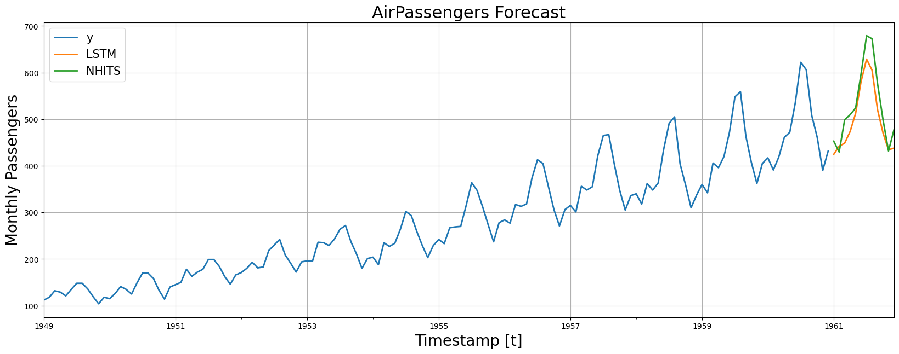

export const quartoRawHtml =
[`<div>
<style scoped>
    .dataframe tbody tr th:only-of-type {
        vertical-align: middle;
    }
    .dataframe tbody tr th {
        vertical-align: top;
    }
    .dataframe thead th {
        text-align: right;
    }
</style>
`,`
</div>`,`<div>
<style scoped>
    .dataframe tbody tr th:only-of-type {
        vertical-align: middle;
    }
    .dataframe tbody tr th {
        vertical-align: top;
    }
    .dataframe thead th {
        text-align: right;
    }
</style>
`,`
</div>`];

> Fit an LSTM and NHITS model

This notebook provides an example on how to start using the main
functionalities of the NeuralForecast library. The `NeuralForecast`
class allows users to easily interact with `NeuralForecast.models`
PyTorch models. In this example we will forecast AirPassengers data with
a classic `LSTM` and the recent `NHITS` models. The full list of
available models is available
[here](https://nixtla.github.io/neuralforecast/models.html).

You can run these experiments using GPU with Google Colab.

<a href="https://colab.research.google.com/github/Nixtla/neuralforecast/blob/main/nbs/examples/Getting_Started.ipynb" target="_parent"></a>

## 1. Installing NeuralForecast {#installing-neuralforecast}

<details>
<summary>Code</summary>

``` python
%%capture
!pip install neuralforecast
```

</details>
<details>
<summary>Code</summary>

``` python
%%capture
import numpy as np
import pandas as pd
from IPython.display import display, Markdown

import matplotlib.pyplot as plt
from neuralforecast import NeuralForecast
from neuralforecast.models import LSTM, NHITS, RNN
from neuralforecast.utils import AirPassengersDF
```

</details>

## 2. Loading AirPassengers Data {#loading-airpassengers-data}

The `core.NeuralForecast` class contains shared, `fit`, `predict` and
other methods that take as inputs pandas DataFrames with columns
`['unique_id', 'ds', 'y']`, where `unique_id` identifies individual time
series from the dataset, `ds` is the date, and `y` is the target
variable.

In this example dataset consists of a set of a single series, but you
can easily fit your model to larger datasets in long format.

<details>
<summary>Code</summary>

``` python
Y_df = AirPassengersDF # Defined in neuralforecast.utils
Y_df.head()
```

</details>
<div dangerouslySetInnerHTML={{ __html: quartoRawHtml[0] }} />

|     | unique_id | ds         | y     |
|-----|-----------|------------|-------|
| 0   | 1.0       | 1949-01-31 | 112.0 |
| 1   | 1.0       | 1949-02-28 | 118.0 |
| 2   | 1.0       | 1949-03-31 | 132.0 |
| 3   | 1.0       | 1949-04-30 | 129.0 |
| 4   | 1.0       | 1949-05-31 | 121.0 |

<div dangerouslySetInnerHTML={{ __html: quartoRawHtml[1] }} />


:::important

DataFrames must include all `['unique_id', 'ds', 'y']` columns. Make
sure `y` column does not have missing or non-numeric values.

:::

## 3. Model Training {#model-training}

### Fit the models {#fit-the-models}

Using the `NeuralForecast.fit` method you can train a set of models to
your dataset. You can define the forecasting `horizon` (12 in this
example), and modify the hyperparameters of the model. For example, for
the `LSTM` we changed the default hidden size for both encoder and
decoders.

<details>
<summary>Code</summary>

``` python
%%capture
horizon = 12

# Try different hyperparmeters to improve accuracy.
models = [LSTM(h=horizon,                    # Forecast horizon
               max_steps=500,                # Number of steps to train
               scaler_type='standard',       # Type of scaler to normalize data
               encoder_hidden_size=64,       # Defines the size of the hidden state of the LSTM
               decoder_hidden_size=64,),     # Defines the number of hidden units of each layer of the MLP decoder
          NHITS(h=horizon,                   # Forecast horizon
                input_size=2 * horizon,      # Length of input sequence
                max_steps=100,               # Number of steps to train
                n_freq_downsample=[2, 1, 1]) # Downsampling factors for each stack output
          ]
nf = NeuralForecast(models=models, freq='M')
nf.fit(df=Y_df)
```

</details>

:::tip

The performance of Deep Learning models can be very sensitive to the
choice of hyperparameters. Tuning the correct hyperparameters is an
important step to obtain the best forecasts. The `Auto` version of these
models, `AutoLSTM` and `AutoNHITS`, already perform hyperparameter
selection automatically.

:::

### Predict using the fitted models {#predict-using-the-fitted-models}

Using the `NeuralForecast.predict` method you can obtain the `h`
forecasts after the training data `Y_df`.

<details>
<summary>Code</summary>

``` python
Y_hat_df = nf.predict()
```

</details>

``` text
Predicting DataLoader 0: 100%|██████████| 1/1 [00:00<00:00, 50.58it/s]
Predicting DataLoader 0: 100%|██████████| 1/1 [00:00<00:00, 126.52it/s]
```

The `NeuralForecast.predict` method returns a DataFrame with the
forecasts for each `unique_id`, `ds`, and model.

<details>
<summary>Code</summary>

``` python
Y_hat_df = Y_hat_df.reset_index()
Y_hat_df.head()
```

</details>
<div dangerouslySetInnerHTML={{ __html: quartoRawHtml[2] }} />

|     | unique_id | ds         | LSTM       | NHITS      |
|-----|-----------|------------|------------|------------|
| 0   | 1.0       | 1961-01-31 | 424.380310 | 453.039185 |
| 1   | 1.0       | 1961-02-28 | 442.092010 | 429.609192 |
| 2   | 1.0       | 1961-03-31 | 448.555664 | 498.796204 |
| 3   | 1.0       | 1961-04-30 | 473.586609 | 509.536224 |
| 4   | 1.0       | 1961-05-31 | 512.466370 | 524.131592 |

<div dangerouslySetInnerHTML={{ __html: quartoRawHtml[3] }} />

## 4. Plot Predictions {#plot-predictions}

Finally, we plot the forecasts of both models againts the real values.

<details>
<summary>Code</summary>

``` python
fig, ax = plt.subplots(1, 1, figsize = (20, 7))
plot_df = pd.concat([Y_df, Y_hat_df]).set_index('ds') # Concatenate the train and forecast dataframes
plot_df[['y', 'LSTM', 'NHITS']].plot(ax=ax, linewidth=2)

ax.set_title('AirPassengers Forecast', fontsize=22)
ax.set_ylabel('Monthly Passengers', fontsize=20)
ax.set_xlabel('Timestamp [t]', fontsize=20)
ax.legend(prop={'size': 15})
ax.grid()
```

</details>



:::tip

For this guide we are using a simple `LSTM` model. More recent models,
such as `RNN`, `GRU`, and `DilatedRNN` achieve better accuracy than
`LSTM` in most settings. The full list of available models is available
[here](https://nixtla.github.io/neuralforecast/models.html).

:::

## References {#references}

-   [Boris N. Oreshkin, Dmitri Carpov, Nicolas Chapados, Yoshua Bengio
    (2020). “N-BEATS: Neural basis expansion analysis for interpretable
    time series forecasting”. International Conference on Learning
    Representations.](https://arxiv.org/abs/1905.10437)<br>
-   [Cristian Challu, Kin G. Olivares, Boris N. Oreshkin, Federico
    Garza, Max Mergenthaler-Canseco, Artur Dubrawski (2021). NHITS:
    Neural Hierarchical Interpolation for Time Series Forecasting.
    Accepted at AAAI 2023.](https://arxiv.org/abs/2201.12886)

