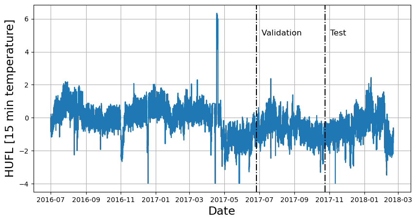
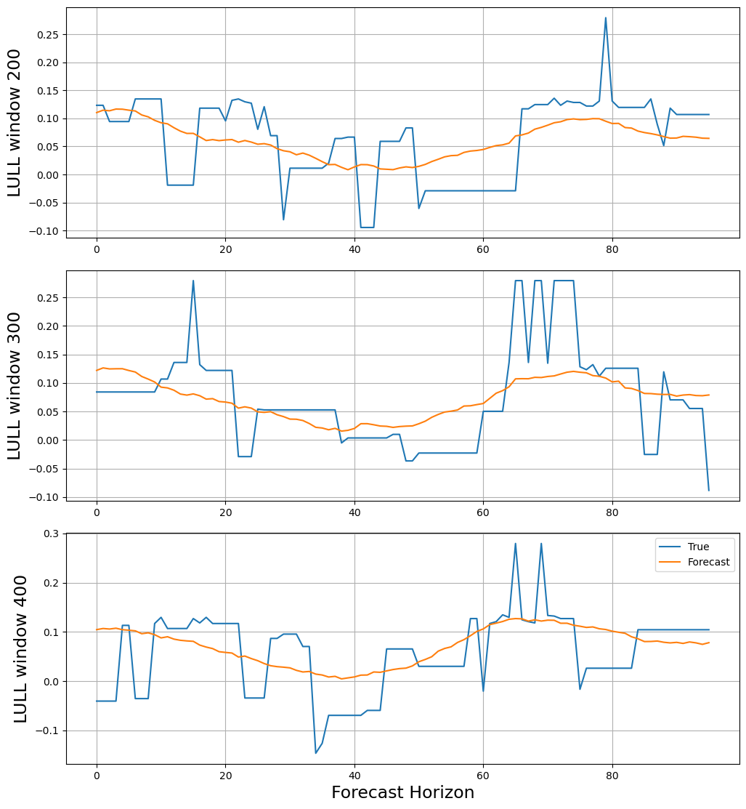

export const quartoRawHtml =
[`<div>
<style scoped>
    .dataframe tbody tr th:only-of-type {
        vertical-align: middle;
    }
    .dataframe tbody tr th {
        vertical-align: top;
    }
    .dataframe thead th {
        text-align: right;
    }
</style>
`,`
</div>`];

Long-horizon forecasting is challenging because of the *volatility* of
the predictions and the *computational complexity*. To solve this
problem we created the [NHITS](https://arxiv.org/abs/2201.12886) model
and made the code available [NeuralForecast
library](https://nixtla.github.io/neuralforecast/models.nhits.html).
`NHITS` specializes its partial outputs in the different frequencies of
the time series through hierarchical interpolation and multi-rate input
processing.

In this notebook we show how to use `NHITS` on the
[ETTm2](https://github.com/zhouhaoyi/ETDataset) benchmark dataset. This
data set includes data points for 2 Electricity Transformers at 2
stations, including load, oil temperature.

We will show you how to load data, train, and perform automatic
hyperparameter tuning, **to achieve SoTA performance**, outperforming
even the latest Transformer architectures for a fraction of their
computational cost (50x faster).

You can run these experiments using GPU with Google Colab.

<a href="https://colab.research.google.com/github/Nixtla/neuralforecast/blob/main/nbs/examples/LongHorizon_with_NHITS.ipynb" target="_parent"></a>

## 1. Installing NeuralForecast {#installing-neuralforecast}

<details>
<summary>Code</summary>

``` python
%%capture
!pip install neuralforecast datasetsforecast
```

</details>
<details>
<summary>Code</summary>

``` python
import torch
import numpy as np
import pandas as pd
import matplotlib.pyplot as plt

from ray import tune

from neuralforecast.auto import AutoNHITS
from neuralforecast.core import NeuralForecast

from neuralforecast.losses.pytorch import MAE
from neuralforecast.losses.numpy import mae, mse
from datasetsforecast.long_horizon import LongHorizon
```

</details>
<details>
<summary>Code</summary>

``` python
import logging
logging.getLogger("pytorch_lightning").setLevel(logging.WARNING)
```

</details>

This example will automatically run on GPUs if available. **Make sure**
cuda is available. (If you need help to put this into production send us
an email or join or community, we also offer a fully hosted solution)

<details>
<summary>Code</summary>

``` python
torch.cuda.is_available()
```

</details>

``` text
True
```

## 2. Load ETTm2 Data {#load-ettm2-data}

The `LongHorizon` class will automatically download the complete ETTm2
dataset and process it.

It return three Dataframes: `Y_df` contains the values for the target
variables, `X_df` contains exogenous calendar features and `S_df`
contains static features for each time-series (none for ETTm2). For this
example we will only use `Y_df`.

If you want to use your own data just replace `Y_df`. Be sure to use a
long format and have a simmilar structure than our data set.

<details>
<summary>Code</summary>

``` python
# Change this to your own data to try the model
Y_df, _, _ = LongHorizon.load(directory='./', group='ETTm2')
Y_df['ds'] = pd.to_datetime(Y_df['ds'])

# For this excercise we are going to take 20% of the DataSet
n_time = len(Y_df.ds.unique())
val_size = int(.2 * n_time)
test_size = int(.2 * n_time)

Y_df.groupby('unique_id').head(2)
```

</details>
<div dangerouslySetInnerHTML={{ __html: quartoRawHtml[0] }} />

|        | unique_id | ds                  | y         |
|--------|-----------|---------------------|-----------|
| 0      | HUFL      | 2016-07-01 00:00:00 | -0.041413 |
| 1      | HUFL      | 2016-07-01 00:15:00 | -0.185467 |
| 57600  | HULL      | 2016-07-01 00:00:00 | 0.040104  |
| 57601  | HULL      | 2016-07-01 00:15:00 | -0.214450 |
| 115200 | LUFL      | 2016-07-01 00:00:00 | 0.695804  |
| 115201 | LUFL      | 2016-07-01 00:15:00 | 0.434685  |
| 172800 | LULL      | 2016-07-01 00:00:00 | 0.434430  |
| 172801 | LULL      | 2016-07-01 00:15:00 | 0.428168  |
| 230400 | MUFL      | 2016-07-01 00:00:00 | -0.599211 |
| 230401 | MUFL      | 2016-07-01 00:15:00 | -0.658068 |
| 288000 | MULL      | 2016-07-01 00:00:00 | -0.393536 |
| 288001 | MULL      | 2016-07-01 00:15:00 | -0.659338 |
| 345600 | OT        | 2016-07-01 00:00:00 | 1.018032  |
| 345601 | OT        | 2016-07-01 00:15:00 | 0.980124  |

<div dangerouslySetInnerHTML={{ __html: quartoRawHtml[1] }} />

<details>
<summary>Code</summary>

``` python
# We are going to plot the temperature of the transformer 
# and marking the validation and train splits
u_id = 'HUFL'
x_plot = pd.to_datetime(Y_df[Y_df.unique_id==u_id].ds)
y_plot = Y_df[Y_df.unique_id==u_id].y.values

x_val = x_plot[n_time - val_size - test_size]
x_test = x_plot[n_time - test_size]

fig = plt.figure(figsize=(10, 5))
fig.tight_layout()

plt.plot(x_plot, y_plot)
plt.xlabel('Date', fontsize=17)
plt.ylabel('HUFL [15 min temperature]', fontsize=17)

plt.axvline(x_val, color='black', linestyle='-.')
plt.axvline(x_test, color='black', linestyle='-.')
plt.text(x_val, 5, '  Validation', fontsize=12)
plt.text(x_test, 5, '  Test', fontsize=12)

plt.grid()
```

</details>



## 3. Hyperparameter selection and forecasting {#hyperparameter-selection-and-forecasting}

The `AutoNHITS` class will automatically perform hyperparamter tunning
using [Tune library](https://docs.ray.io/en/latest/tune/index.html),
exploring a user-defined or default search space. Models are selected
based on the error on a validation set and the best model is then stored
and used during inference.

The `AutoNHITS.default_config` attribute contains a suggested
hyperparameter space. Here, we specify a different search space
following the paper’s hyperparameters. Notice that *1000 Stochastic
Gradient Steps* are enough to achieve SoTA performance. Feel free to
play around with this space.

<details>
<summary>Code</summary>

``` python
horizon = 96 # 24hrs = 4 * 15 min.

# Use your own config or AutoNHITS.default_config
nhits_config = {
       "learning_rate": tune.choice([1e-3]),                                     # Initial Learning rate
       "max_steps": tune.choice([1000]),                                         # Number of SGD steps
       "input_size": tune.choice([5 * horizon]),                                 # input_size = multiplier * horizon
       "batch_size": tune.choice([7]),                                           # Number of series in windows
       "windows_batch_size": tune.choice([256]),                                 # Number of windows in batch
       "n_pool_kernel_size": tune.choice([[2, 2, 2], [16, 8, 1]]),               # MaxPool's Kernelsize
       "n_freq_downsample": tune.choice([[168, 24, 1], [24, 12, 1], [1, 1, 1]]), # Interpolation expressivity ratios
       "activation": tune.choice(['ReLU']),                                      # Type of non-linear activation
       "n_blocks":  tune.choice([[1, 1, 1]]),                                    # Blocks per each 3 stacks
       "mlp_units":  tune.choice([[[512, 512], [512, 512], [512, 512]]]),        # 2 512-Layers per block for each stack
       "interpolation_mode": tune.choice(['linear']),                            # Type of multi-step interpolation
       "val_check_steps": tune.choice([100]),                                    # Compute validation every 100 epochs
       "random_seed": tune.randint(1, 10),
    }
```

</details>

:::tip

Refer to https://docs.ray.io/en/latest/tune/index.html for more
information on the different space options, such as lists and continous
intervals.m

:::

To instantiate `AutoNHITS` you need to define:

-   `h`: forecasting horizon
-   `loss`: training loss. Use the `DistributionLoss` to produce
    probabilistic forecasts.
-   `config`: hyperparameter search space. If `None`, the `AutoNHITS`
    class will use a pre-defined suggested hyperparameter space.
-   `num_samples`: number of configurations explored.

<details>
<summary>Code</summary>

``` python
models = [AutoNHITS(h=horizon,
                    config=nhits_config, 
                    num_samples=5)]
```

</details>

``` text
INFO:torch.distributed.nn.jit.instantiator:Created a temporary directory at /tmp/tmp0ke5wzvj
INFO:torch.distributed.nn.jit.instantiator:Writing /tmp/tmp0ke5wzvj/_remote_module_non_scriptable.py
```

Fit the model by instantiating a `NeuralForecast` object with the
following required parameters:

-   `models`: a list of models.

-   `freq`: a string indicating the frequency of the data. (See [panda’s
    available
    frequencies](https://pandas.pydata.org/pandas-docs/stable/user_guide/timeseries.html#offset-aliases).)

The `cross_validation` method allows you to simulate multiple historic
forecasts, greatly simplifying pipelines by replacing for loops with
`fit` and `predict` methods.

With time series data, cross validation is done by defining a sliding
window across the historical data and predicting the period following
it. This form of cross validation allows us to arrive at a better
estimation of our model’s predictive abilities across a wider range of
temporal instances while also keeping the data in the training set
contiguous as is required by our models.

The `cross_validation` method will use the validation set for
hyperparameter selection, and will then produce the forecasts for the
test set.

<details>
<summary>Code</summary>

``` python
%%capture
nf = NeuralForecast(
    models=models,
    freq='15min')

Y_hat_df = nf.cross_validation(df=Y_df, val_size=val_size,
                               test_size=test_size, n_windows=None)
```

</details>

``` text
INFO:ray.tune.tune:Initializing Ray automatically.For cluster usage or custom Ray initialization, call `ray.init(...)` before `tune.run`.
```

## 4. Evaluate Results {#evaluate-results}

The `AutoNHITS` class contains a `results` tune attribute that stores
information of each configuration explored. It contains the validation
loss and best validation hyperparameter.

<details>
<summary>Code</summary>

``` python
nf.models[0].results.get_best_result().config
```

</details>

``` text
{'learning_rate': 0.001,
 'max_steps': 1000,
 'input_size': 480,
 'batch_size': 7,
 'windows_batch_size': 256,
 'n_pool_kernel_size': [2, 2, 2],
 'n_freq_downsample': [24, 12, 1],
 'activation': 'ReLU',
 'n_blocks': [1, 1, 1],
 'mlp_units': [[512, 512], [512, 512], [512, 512]],
 'interpolation_mode': 'linear',
 'check_val_every_n_epoch': 100,
 'random_seed': 4,
 'h': 96,
 'loss': MAE()}
```

<details>
<summary>Code</summary>

``` python
y_true = Y_hat_df.y.values
y_hat = Y_hat_df['AutoNHITS'].values

n_series = len(Y_df.unique_id.unique())

y_true = y_true.reshape(n_series, -1, horizon)
y_hat = y_hat.reshape(n_series, -1, horizon)

print('Parsed results')
print('2. y_true.shape (n_series, n_windows, n_time_out):\t', y_true.shape)
print('2. y_hat.shape  (n_series, n_windows, n_time_out):\t', y_hat.shape)
```

</details>

``` text
Parsed results
2. y_true.shape (n_series, n_windows, n_time_out):   (7, 11425, 96)
2. y_hat.shape  (n_series, n_windows, n_time_out):   (7, 11425, 96)
```

<details>
<summary>Code</summary>

``` python
fig, axs = plt.subplots(nrows=3, ncols=1, figsize=(10, 11))
fig.tight_layout()

series = ['HUFL','HULL','LUFL','LULL','MUFL','MULL','OT']
series_idx = 3

for idx, w_idx in enumerate([200, 300, 400]):
  axs[idx].plot(y_true[series_idx, w_idx,:],label='True')
  axs[idx].plot(y_hat[series_idx, w_idx,:],label='Forecast')
  axs[idx].grid()
  axs[idx].set_ylabel(series[series_idx]+f' window {w_idx}', 
                      fontsize=17)
  if idx==2:
    axs[idx].set_xlabel('Forecast Horizon', fontsize=17)
plt.legend()
plt.show()
plt.close()
```

</details>



Finally, we compute the test errors for the two metrics of interest
(which are also available in the `trials` object):

$\qquad MAE = \frac{1}{Windows * Horizon} \sum_{\tau} |y_{\tau} - \hat{y}_{\tau}| \qquad$
and
$\qquad MSE = \frac{1}{Windows * Horizon} \sum_{\tau} (y_{\tau} - \hat{y}_{\tau})^{2} \qquad$

<details>
<summary>Code</summary>

``` python
print('MAE: ', mae(y_hat, y_true))
print('MSE: ', mse(y_hat, y_true))
```

</details>

``` text
MAE:  0.26096806135482414
MSE:  0.18279484416711375
```

For reference we can check the performance when compared to previous
‘state-of-the-art’ long-horizon Transformer-based forecasting methods
from the [NHITS paper](https://arxiv.org/abs/2201.12886). To recover or
improve the paper results try setting `hyperopt_max_evals=30` in
[Hyperparameter Tuning](#cell-4).

Mean Absolute Error (MAE):

| Horizon | NHITS     | AutoFormer | InFormer | ARIMA |
|---------|-----------|------------|----------|-------|
| 96      | **0.255** | 0.339      | 0.453    | 0.301 |
| 192     | 0.305     | 0.340      | 0.563    | 0.345 |
| 336     | 0.346     | 0.372      | 0.887    | 0.386 |
| 720     | 0.426     | 0.419      | 1.388    | 0.445 |

Mean Squared Error (MSE):

| Horizon | NHITS     | AutoFormer | InFormer | ARIMA |
|---------|-----------|------------|----------|-------|
| 96      | **0.176** | 0.255      | 0.365    | 0.225 |
| 192     | 0.245     | 0.281      | 0.533    | 0.298 |
| 336     | 0.295     | 0.339      | 1.363    | 0.370 |
| 720     | 0.401     | 0.422      | 3.379    | 0.478 |

## References {#references}

[Cristian Challu, Kin G. Olivares, Boris N. Oreshkin, Federico Garza,
Max Mergenthaler-Canseco, Artur Dubrawski (2021). NHITS: Neural
Hierarchical Interpolation for Time Series Forecasting. Accepted at AAAI
2023.](https://arxiv.org/abs/2201.12886)

