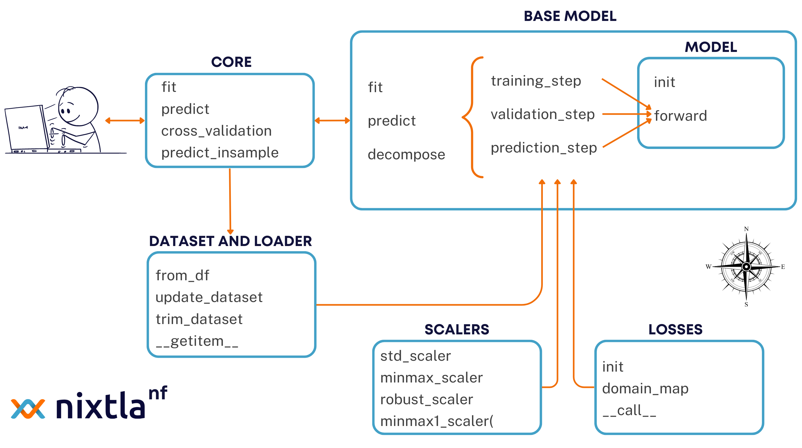

> Modules of the NeuralForecast library

The `neuralforecast` library provides a comprehensive set of
state-of-the-art deep learning models designed to power-up time series
forecasting pipelines.

The library is constructed using a modular approach, where different
responsibilities are isolated within specific modules. These modules
include the user interface functions (`core`), data processing and
loading (`tsdataset`), scalers, losses, and base classes for models.

This tutorial aims to explain the library’s structure and to describe
how the different modules interact with each other.

## I. Map {#i.-map}

The following diagram presents the modules of the `neuralforecast`
library and their relations.

## II. Modules {#ii.-modules}

### 1. Core (`core.py`) {#core-core.py}

The `core` module acts as the primary interaction point for users of the
`neuralforecast` library. It houses the `NeuralForecast` class, which
incorporates a range of key user interface functions designed to
simplify the process of training and forecasting models. Functions
include `fit`, `predict`, `cross_validation`, and `predict_insample`,
each one constructed to be intuitive and user-friendly. The design of
the `NeuralForecast` class is centered around enabling users to
streamline their forecasting pipelines and to comfortably train and
evaluate models.

### 2. Dataset and Loader (`tsdataset.py`) {#dataset-and-loader-tsdataset.py}

The `TimeSeriesDataset` class, located within the `tsdataset` module, is
responsible for the storage and preprocessing of the input time series
dataset. Once the `TimeSeriesDataset` class has prepared the data, it’s
then consumed by the `TimeSeriesLoader` class, which samples batches (or
subsets) of the time series during the training and inference stages.

### 3. Base Model (`common`) {#base-model-common}

The `common` module contains three `BaseModel` classes, which serve as
the foundation for all the model structures provided in the library.
These base classes allow for a level of abstraction and code-reusability
in the design of the models. We currently support three type of models:

-   `BaseWindows`: designed for window-based models like `NBEATS` and
    `Transformers`.
-   `BaseRecurrent`: designed for recurrent models like `RNN` and
    `LSTM`.
-   `BaseMultivariate`: caters to multivariate models like `StemGNN`.

### 4. Model (`models`) {#model-models}

The `models` module encompasses all the specific model classes available
for use in the library. These include a variety of both simple and
complex models such as `RNN`, `NHITS`, `LSTM`, `StemGNN`, and `TFT`.
Each model in this module extends from one of the `BaseModel` classes in
the `common` module.

### 5. Losses (`losses`) {#losses-losses}

The `losses` module includes both `numpy` and `pytorch` losses, used for
evalaution and training respectively. The module contains a wide range
of losses, including `MAE`, `MSE`, `MAPE`, `HuberLoss`, among many
others.

### 6. Scalers (`_scalers.py`) {#scalers-_scalers.py}

The `_scalers.py` module houses the `TemporalNorm` class. This class is
responsible for the scaling (normalization) and de-scaling (reversing
the normalization) of time series data. This step is crucial because it
ensures all data fed to the model have a similar range, leading to more
stable and efficient training processes.

## III. Flow {#iii.-flow}

The `user` first instantiates a model and the `NeuralForecast` core
class. When they call the `fit` method, the following flow is executed:

1.  The `fit` method instantiates a `TimeSeriesDataset` object to store
    and pre-process the input time series dataset, and the
    `TimeSeriesLoader` object to sample batches.
2.  The `fit` method calls the model’s `fit` method (in the `BaseModel`
    class).
3.  The model’s `fit` method instantiates a Pytorch-Lightning `Trainer`
    object, in charge of training the model.
4.  The `Trainer` method samples a batch from the `TimeSeriesLoader`
    object, and calls the model’s `training_step` method (in the
    `BaseModel` class).
5.  The model’s `training_step`:
    -   Samples windows from the original batch.
    -   Normalizes the windows with the `scaler` module.
    -   Calls the model’s `forward` method.
    -   Computes the loss using the `losses` module.
    -   Returns the loss.
6.  The `Trainer` object repeats step 4 and 5 until `max_steps`
    iterations are completed.
7.  The model is fitted, and can be used for forecasting future values
    (with the `predict` method) or recover insample predictions (using
    the `predict_insample` method).

## IV. Next Steps: add your own model {#iv.-next-steps-add-your-own-model}

Congratulations! You now know the internal details of the
`neuralforecast` library.

With this knowledge you can easily add new models to the library, by
just creating a `model` class which only requires the `init` and
`forward` methods.

Check our detailed guide on how to add new models!

