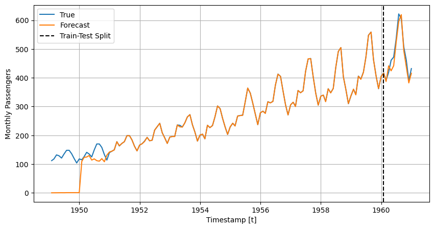

export const quartoRawHtml =
[`<div>
<style scoped>
    .dataframe tbody tr th:only-of-type {
        vertical-align: middle;
    }
    .dataframe tbody tr th {
        vertical-align: top;
    }
    .dataframe thead th {
        text-align: right;
    }
</style>
`,`
</div>`,`<div>
<style scoped>
    .dataframe tbody tr th:only-of-type {
        vertical-align: middle;
    }
    .dataframe tbody tr th {
        vertical-align: top;
    }
    .dataframe thead th {
        text-align: right;
    }
</style>
`,`
</div>`];

> Tutorial on how to produce insample predictions.

This tutorial provides and example on how to use the `predict_insample`
function of the `core` class to produce forecasts of the train and
validation sets. In this example we will train the `NHITS` model on the
AirPassengers data, and show how to recover the insample predictions
after model is fitted.

*Predict Insample*: The process of producing forecasts of the train and
validation sets.

*Use Cases*: \* Debugging: producing insample predictions is useful for
debugging purposes. For example, to check if the model is able to fit
the train set. \* Training convergence: check if the the model has
converged. \* Anomaly detection: insample predictions can be used to
detect anomalous behavior in the train set (e.g. outliers). (Note: if a
model is too flexible it might be able to perfectly forecast outliers)

You can run these experiments using GPU with Google Colab.

<a href="https://colab.research.google.com/github/Nixtla/neuralforecast/blob/main/nbs/examples/PredictInsample.ipynb" target="_parent"></a>

## 1. Installing NeuralForecast {#installing-neuralforecast}

<details>
<summary>Code</summary>

``` python
%%capture
!pip install neuralforecast
```

</details>

## 2. Loading AirPassengers Data {#loading-airpassengers-data}

The `core.NeuralForecast` class contains shared, `fit`, `predict` and
other methods that take as inputs pandas DataFrames with columns
`['unique_id', 'ds', 'y']`, where `unique_id` identifies individual time
series from the dataset, `ds` is the date, and `y` is the target
variable.

In this example dataset consists of a set of a single series, but you
can easily fit your model to larger datasets in long format.

<details>
<summary>Code</summary>

``` python
%%capture
from neuralforecast.utils import AirPassengersDF
```

</details>
<details>
<summary>Code</summary>

``` python
Y_df = AirPassengersDF # Defined in neuralforecast.utils
Y_df.head()
```

</details>
<div dangerouslySetInnerHTML={{ __html: quartoRawHtml[0] }} />

|     | unique_id | ds         | y     |
|-----|-----------|------------|-------|
| 0   | 1.0       | 1949-01-31 | 112.0 |
| 1   | 1.0       | 1949-02-28 | 118.0 |
| 2   | 1.0       | 1949-03-31 | 132.0 |
| 3   | 1.0       | 1949-04-30 | 129.0 |
| 4   | 1.0       | 1949-05-31 | 121.0 |

<div dangerouslySetInnerHTML={{ __html: quartoRawHtml[1] }} />

## 3. Model Training {#model-training}

First, we train the `NHITS` models on the AirPassengers data. We will
use the `fit` method of the `core` class to train the models.

<details>
<summary>Code</summary>

``` python
import pandas as pd

from neuralforecast import NeuralForecast
from neuralforecast.models import NHITS
```

</details>
<details>
<summary>Code</summary>

``` python
%%capture
horizon = 12

# Try different hyperparmeters to improve accuracy.
models = [NHITS(h=horizon,                      # Forecast horizon
                input_size=2 * horizon,         # Length of input sequence
                max_steps=1000,                 # Number of steps to train
                n_freq_downsample=[2, 1, 1],    # Downsampling factors for each stack output
                mlp_units = 3 * [[1024, 1024]]) # Number of units in each block.
          ]
nf = NeuralForecast(models=models, freq='M')
nf.fit(df=Y_df, val_size=horizon)
```

</details>

## 4. Predict Insample {#predict-insample}

Using the `NeuralForecast.predict_insample` method you can obtain the
forecasts for the train and validation sets after the models are fitted.
The function will always take the last dataset used for training in
either the `fit` or `cross_validation` methods.

With the `step_size` parameter you can specify the step size between
consecutive windows to produce the forecasts. In this example we will
set `step_size=horizon` to produce non-overlapping forecasts.

The following diagram shows how the forecasts are produced based on the
`step_size` parameter and `h` (horizon) of the model. In the diagram we
set `step_size=2` and `h=4`.


<details>
<summary>Code</summary>

``` python
Y_hat_insample = nf.predict_insample(step_size=horizon)
```

</details>

``` text
Predicting DataLoader 0: 100%|██████████| 1/1 [00:00<00:00, 37.76it/s]
```

The `predict_insample` function returns a pandas DataFrame with the
following columns: \* `unique_id`: the unique identifier of the time
series. \* `ds`: the datestamp of the forecast for each row. \*
`cutoff`: the datestamp at which the forecast was made. \* `y`: the
actual value of the target variable. \* `model_name`: the forecasted
values for the models. In this case, `NHITS`.

<details>
<summary>Code</summary>

``` python
Y_hat_insample.head()
```

</details>
<div dangerouslySetInnerHTML={{ __html: quartoRawHtml[2] }} />

|     | unique_id | ds         | cutoff     | NHITS    | y     |
|-----|-----------|------------|------------|----------|-------|
| 0   | 1.0       | 1949-01-31 | 1948-12-31 | 0.204289 | 112.0 |
| 1   | 1.0       | 1949-02-28 | 1948-12-31 | 0.302111 | 118.0 |
| 2   | 1.0       | 1949-03-31 | 1948-12-31 | 0.399522 | 132.0 |
| 3   | 1.0       | 1949-04-30 | 1948-12-31 | 0.429369 | 129.0 |
| 4   | 1.0       | 1949-05-31 | 1948-12-31 | 0.518200 | 121.0 |

<div dangerouslySetInnerHTML={{ __html: quartoRawHtml[3] }} />


:::important

The function will produce forecasts from the first timestamp of the time
series. For these initial timestamps, the forecasts might not be
accurate given that models have very limited input information to
produce forecasts.

:::

## 5. Plot Predictions {#plot-predictions}

Finally, we plot the forecasts for the train and validation sets.

<details>
<summary>Code</summary>

``` python
import matplotlib.pyplot as plt
```

</details>
<details>
<summary>Code</summary>

``` python
plt.figure(figsize=(10, 5))
plt.plot(Y_hat_insample['ds'], Y_hat_insample['y'], label='True')
plt.plot(Y_hat_insample['ds'], Y_hat_insample['NHITS'], label='Forecast')
plt.axvline(Y_hat_insample['ds'].iloc[-12], color='black', linestyle='--', label='Train-Test Split')
plt.xlabel('Timestamp [t]')
plt.ylabel('Monthly Passengers')
plt.grid()
plt.legend()
```

</details>

``` text
<matplotlib.legend.Legend>
```



:::important

Note how the forecasts for the train set are very accurate, while the
forecast in the validation set (last 12 timetamps), are less precise.
This is because the model was trained on the train set, and deep
learning models such as the `NHITS` can easily overfit the train set.

:::

## References {#references}

-   [Cristian Challu, Kin G. Olivares, Boris N. Oreshkin, Federico
    Garza, Max Mergenthaler-Canseco, Artur Dubrawski (2021). NHITS:
    Neural Hierarchical Interpolation for Time Series Forecasting.
    Accepted at AAAI 2023.](https://arxiv.org/abs/2201.12886)

