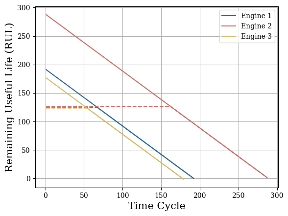
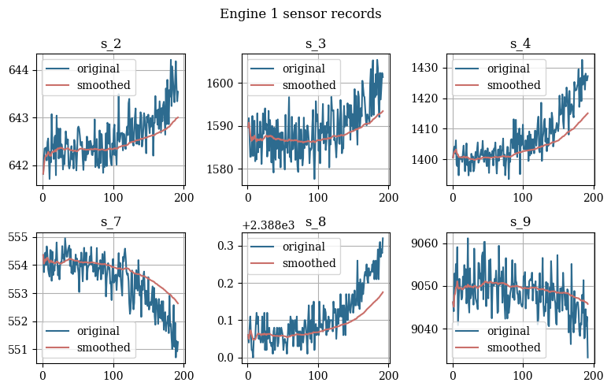
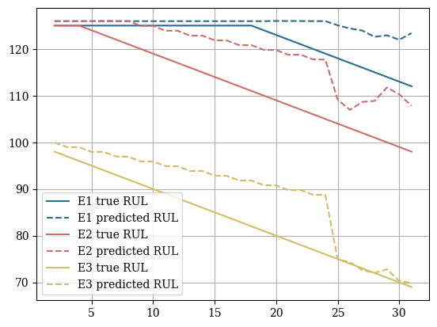

export const quartoRawHtml =
[`<div>
<style scoped>
    .dataframe tbody tr th:only-of-type {
        vertical-align: middle;
    }
    .dataframe tbody tr th {
        vertical-align: top;
    }
    .dataframe thead th {
        text-align: right;
    }
</style>
`,`
<p>20631 rows × 17 columns</p>
</div>`];

Predictive maintenance (PdM) is a data-driven preventive maintanance
program. It is a proactive maintenance strategy that uses sensors to
monitor the performance and equipment conditions during operation. The
PdM methods constantly analyze the data to predict when optimal
maintenance schedules. It can reduce maintenance costs and prevent
catastrophic equipment failure when used correctly.

In this notebook, we will apply NeuralForecast to perform a supervised
Remaining Useful Life (RUL) estimation on the classic PHM2008 aircraft
degradation dataset.

Outline<br> 1. Installing Packages<br> 2. Load PHM2008 aircraft
degradation dataset<br> 3. Fit and Predict NeuralForecast<br> 4.
Evaluate Predictions

You can run these experiments using GPU with Google Colab.

<a href="https://colab.research.google.com/github/Nixtla/neuralforecast/blob/main/nbs/examples/Predictive_Maintenance.ipynb" target="_parent"></a>

## 1. Installing Packages {#installing-packages}

<details>
<summary>Code</summary>

``` python
# %%capture
# !pip install git+https://github.com/Nixtla/neuralforecast.git
```

</details>
<details>
<summary>Code</summary>

``` python
# %%capture
# !pip install git+https://github.com/Nixtla/datasetsforecast.git@predictive_maintenance
```

</details>
<details>
<summary>Code</summary>

``` python
import numpy as np
import pandas as pd

import matplotlib.pyplot as plt
plt.rcParams['font.family'] = 'serif'

from neuralforecast.models import NBEATSx, MLP
from neuralforecast import NeuralForecast
#from neuralforecast.losses.pytorch import DistributionLoss, HuberMQLoss, MQLoss
from neuralforecast.losses.pytorch import HuberLoss, MAE

from datasetsforecast.phm2008 import PHM2008
```

</details>

## 2. Load PHM2008 aircraft degradation dataset {#load-phm2008-aircraft-degradation-dataset}

Here we will load the Prognosis and Health Management 2008 challenge
dataset. This dataset used the Commercial Modular Aero-Propulsion System
Simulation to recreate the degradation process of turbofan engines for
different aircraft with varying wear and manufacturing starting under
normal conditions. The training dataset consists of complete
run-to-failure simulations, while the test dataset comprises sequences
before failure.


<details>
<summary>Code</summary>

``` python
Y_train_df, Y_test_df = PHM2008.load(directory='./data', group='FD001', clip_rul=False)
Y_train_df
```

</details>
<div dangerouslySetInnerHTML={{ __html: quartoRawHtml[0] }} />

|       | unique_id | ds  | s_2    | s_3     | s_4     | s_7    | s_8     | s_9     | s_11  | s_12   | s_13    | s_14    | s_15   | s_17 | s_20  | s_21    | y   |
|-------|-----------|-----|--------|---------|---------|--------|---------|---------|-------|--------|---------|---------|--------|------|-------|---------|-----|
| 0     | 1         | 1   | 641.82 | 1589.70 | 1400.60 | 554.36 | 2388.06 | 9046.19 | 47.47 | 521.66 | 2388.02 | 8138.62 | 8.4195 | 392  | 39.06 | 23.4190 | 191 |
| 1     | 1         | 2   | 642.15 | 1591.82 | 1403.14 | 553.75 | 2388.04 | 9044.07 | 47.49 | 522.28 | 2388.07 | 8131.49 | 8.4318 | 392  | 39.00 | 23.4236 | 190 |
| 2     | 1         | 3   | 642.35 | 1587.99 | 1404.20 | 554.26 | 2388.08 | 9052.94 | 47.27 | 522.42 | 2388.03 | 8133.23 | 8.4178 | 390  | 38.95 | 23.3442 | 189 |
| 3     | 1         | 4   | 642.35 | 1582.79 | 1401.87 | 554.45 | 2388.11 | 9049.48 | 47.13 | 522.86 | 2388.08 | 8133.83 | 8.3682 | 392  | 38.88 | 23.3739 | 188 |
| 4     | 1         | 5   | 642.37 | 1582.85 | 1406.22 | 554.00 | 2388.06 | 9055.15 | 47.28 | 522.19 | 2388.04 | 8133.80 | 8.4294 | 393  | 38.90 | 23.4044 | 187 |
| ...   | ...       | ... | ...    | ...     | ...     | ...    | ...     | ...     | ...   | ...    | ...     | ...     | ...    | ...  | ...   | ...     | ... |
| 20626 | 100       | 196 | 643.49 | 1597.98 | 1428.63 | 551.43 | 2388.19 | 9065.52 | 48.07 | 519.49 | 2388.26 | 8137.60 | 8.4956 | 397  | 38.49 | 22.9735 | 4   |
| 20627 | 100       | 197 | 643.54 | 1604.50 | 1433.58 | 550.86 | 2388.23 | 9065.11 | 48.04 | 519.68 | 2388.22 | 8136.50 | 8.5139 | 395  | 38.30 | 23.1594 | 3   |
| 20628 | 100       | 198 | 643.42 | 1602.46 | 1428.18 | 550.94 | 2388.24 | 9065.90 | 48.09 | 520.01 | 2388.24 | 8141.05 | 8.5646 | 398  | 38.44 | 22.9333 | 2   |
| 20629 | 100       | 199 | 643.23 | 1605.26 | 1426.53 | 550.68 | 2388.25 | 9073.72 | 48.39 | 519.67 | 2388.23 | 8139.29 | 8.5389 | 395  | 38.29 | 23.0640 | 1   |
| 20630 | 100       | 200 | 643.85 | 1600.38 | 1432.14 | 550.79 | 2388.26 | 9061.48 | 48.20 | 519.30 | 2388.26 | 8137.33 | 8.5036 | 396  | 38.37 | 23.0522 | 0   |

<div dangerouslySetInnerHTML={{ __html: quartoRawHtml[1] }} />

<details>
<summary>Code</summary>

``` python
plot_df1 = Y_train_df[Y_train_df['unique_id']==1]
plot_df2 = Y_train_df[Y_train_df['unique_id']==2]
plot_df3 = Y_train_df[Y_train_df['unique_id']==3]

plt.plot(plot_df1.ds, np.minimum(plot_df1.y, 125), color='#2D6B8F', linestyle='--')
plt.plot(plot_df1.ds, plot_df1.y, color='#2D6B8F', label='Engine 1')

plt.plot(plot_df2.ds, np.minimum(plot_df2.y, 125)+1.5, color='#CA6F6A', linestyle='--')
plt.plot(plot_df2.ds, plot_df2.y+1.5, color='#CA6F6A', label='Engine 2')

plt.plot(plot_df3.ds, np.minimum(plot_df3.y, 125)-1.5, color='#D5BC67', linestyle='--')
plt.plot(plot_df3.ds, plot_df3.y-1.5, color='#D5BC67', label='Engine 3')

plt.ylabel('Remaining Useful Life (RUL)', fontsize=15)
plt.xlabel('Time Cycle', fontsize=15)
plt.legend()
plt.grid()
```

</details>



<details>
<summary>Code</summary>

``` python
def smooth(s, b = 0.98):
    v = np.zeros(len(s)+1) #v_0 is already 0.
    bc = np.zeros(len(s)+1)
    for i in range(1, len(v)): #v_t = 0.95
        v[i] = (b * v[i-1] + (1-b) * s[i-1]) 
        bc[i] = 1 - b**i
    sm = v[1:] / bc[1:]
    return sm

unique_id = 1
plot_df = Y_train_df[Y_train_df.unique_id == unique_id].copy()

fig, axes = plt.subplots(2,3, figsize = (8,5))
fig.tight_layout()

j = -1
#, 's_11', 's_12', 's_13', 's_14', 's_15', 's_17', 's_20', 's_21'
for feature in ['s_2', 's_3', 's_4', 's_7', 's_8', 's_9']:
    if ('s' in feature) and ('smoothed' not in feature):
        j += 1
        axes[j // 3, j % 3].plot(plot_df.ds, plot_df[feature], 
                                 c = '#2D6B8F', label = 'original')
        axes[j // 3, j % 3].plot(plot_df.ds, smooth(plot_df[feature].values), 
                                 c = '#CA6F6A', label = 'smoothed')
        #axes[j // 3, j % 3].plot([10,10],[0,1], c = 'black')
        axes[j // 3, j % 3].set_title(feature)
        axes[j // 3, j % 3].grid()
        axes[j // 3, j % 3].legend()
        
plt.suptitle(f'Engine {unique_id} sensor records')
plt.tight_layout()
```

</details>



## 3. Fit and Predict NeuralForecast {#fit-and-predict-neuralforecast}

NeuralForecast methods are capable of addressing regression problems
involving various variables. The regression problem involves predicting
the target variable $y_{t+h}$ based on its lags $y_{:t}$, temporal
exogenous features $x^{(h)}_{:t}$, exogenous features available at the
time of prediction $x^{(f)}_{:t+h}$, and static features $x^{(s)}$.

The task of estimating the remaining useful life (RUL) simplifies the
problem to a single horizon prediction $h=1$, where the objective is to
predict $y_{t+1}$ based on the exogenous features $x^{(f)}_{:t+1}$ and
static features $x^{(s)}$. In the RUL estimation task, the exogenous
features typically correspond to sensor monitoring information, while
the target variable represents the RUL itself.

$$P(y_{t+1}\;|\;x^{(f)}_{:t+1},x^{(s)})$$

<details>
<summary>Code</summary>

``` python
Y_train_df, Y_test_df = PHM2008.load(directory='./data', group='FD001', clip_rul=True)
```

</details>
<details>
<summary>Code</summary>

``` python
%%capture
futr_exog_list =['s_2', 's_3', 's_4', 's_7', 's_8', 's_9', 's_11',
                 's_12', 's_13', 's_14', 's_15', 's_17', 's_20', 's_21']

model = NBEATSx(h=1, input_size=24,
                loss=HuberLoss(),
                scaler_type='robust',
                stack_types=['identity', 'identity', 'identity'],
                dropout_prob_theta=0.5,
                futr_exog_list=futr_exog_list,
                exclude_insample_y = True,
                max_steps=1000)
nf = NeuralForecast(models=[model], freq='M')

nf.fit(df=Y_train_df)
Y_hat_df = nf.predict(futr_df=Y_test_df).reset_index() # By default last window?
```

</details>

``` text
Global seed set to 1
```

<details>
<summary>Code</summary>

``` python
%%capture
filter_test_df = Y_test_df.groupby('unique_id').tail(31).reset_index()
Y_hat_df2 = nf.cross_validation(df=filter_test_df, n_windows=30, fit_models=False)
```

</details>

## 4. Evaluate Predictions {#evaluate-predictions}

In the original PHM2008 dataset the true RUL values for the test set are
only provided for the last time cycle of each enginge. We will filter
the predictions to only evaluate the last time cycle.

$$RMSE(\mathbf{y}_{T},\hat{\mathbf{y}}_{T}) = \sqrt{\frac{1}{|\mathcal{D}_{test}|} \sum_{i} (y_{i,T}-\hat{y}_{i,T})^{2}}$$

$$R2(\mathbf{y}_{T},\hat{\mathbf{y}}_{T}) = 1- \frac{\sum_{i} (y_{i,T}-\hat{y}_{i,T})^{2}}{\sum_{i} (y_{i,T}-\bar{y}_{i,T})^{2}}$$

<details>
<summary>Code</summary>

``` python
from sklearn.metrics import r2_score
from neuralforecast.losses.numpy import rmse

model_name = repr(nf.models[0])
y_last = Y_test_df[['unique_id', 'y']].groupby('unique_id').last().reset_index()
y_hat_last = Y_hat_df[['unique_id', model_name]].groupby('unique_id').last().reset_index()
y_last = y_last['y']
y_hat_last = y_hat_last[model_name]

rmse_eval = rmse(y=y_last, y_hat=y_hat_last)
r2_eval = r2_score(y_true=y_last, y_pred=y_hat_last)

print(f'{model_name} Prognosis Evaluation')
print(f'RMSE:\t {rmse_eval:.3f}')
print(f'R2:\t {r2_eval:.3f}')
```

</details>

``` text
NBEATSx Prognosis Evaluation
RMSE:    4.119
R2:  0.989
```

<details>
<summary>Code</summary>

``` python
plt.scatter(y_last, y_hat_last)
plt.xlabel('True RUL', fontsize=15)
plt.ylabel('RUL Prediction', fontsize=15)
plt.grid()
```

</details>


<details>
<summary>Code</summary>

``` python
plot_df1 = Y_hat_df2[Y_hat_df2['unique_id']==1]
plot_df2 = Y_hat_df2[Y_hat_df2['unique_id']==2]
plot_df3 = Y_hat_df2[Y_hat_df2['unique_id']==3]

plt.plot(plot_df1.ds, plot_df1['y'], c='#2D6B8F', label='E1 true RUL')
plt.plot(plot_df1.ds, plot_df1[model_name]+1, c='#2D6B8F', linestyle='--', label='E1 predicted RUL')

plt.plot(plot_df1.ds, plot_df2['y'], c='#CA6F6A', label='E2 true RUL')
plt.plot(plot_df1.ds, plot_df2[model_name]+1, c='#CA6F6A', linestyle='--', label='E2 predicted RUL')

plt.plot(plot_df1.ds, plot_df3['y'], c='#D5BC67', label='E3 true RUL')
plt.plot(plot_df1.ds, plot_df3[model_name]+1, c='#D5BC67', linestyle='--', label='E3 predicted RUL')

plt.legend()
plt.grid()
```

</details>



## References {#references}

-   [R. Keith Mobley (2002). “An Introduction to Predictive
    Maintenance”](https://www.irantpm.ir/wp-content/uploads/2008/02/an-introduction-to-predictive-maintenance.pdf)<br>
-   [Saxena, A., Goebel, K., Simon, D.,&Eklund, N. (2008). “Damage
    propagation modeling for aircraft engine run-to-failure simulation”.
    International conference on prognostics and health
    management.](https://ntrs.nasa.gov/api/citations/20090029214/downloads/20090029214.pdf)

