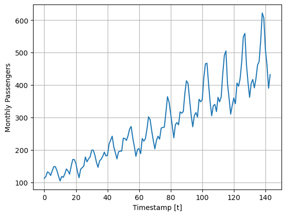
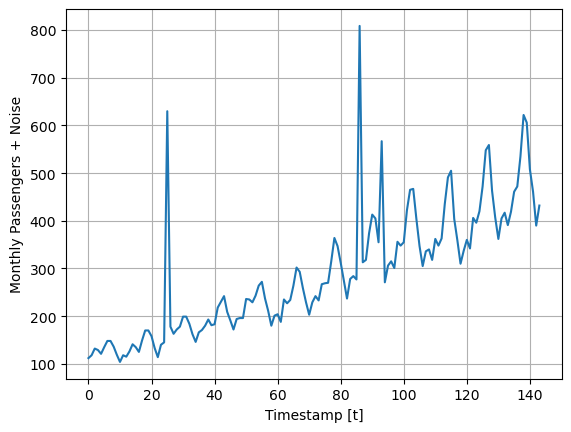
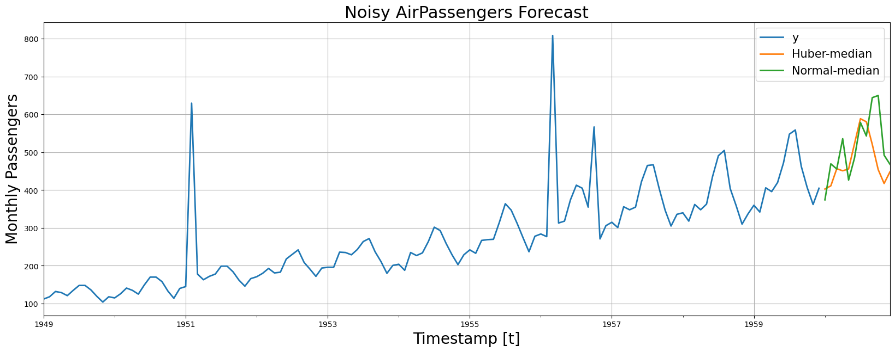

export const quartoRawHtml =
[`<div>
<style scoped>
    .dataframe tbody tr th:only-of-type {
        vertical-align: middle;
    }
    .dataframe tbody tr th {
        vertical-align: top;
    }
    .dataframe thead th {
        text-align: right;
    }
</style>
`,`
</div>`,`<div>
<style scoped>
    .dataframe tbody tr th:only-of-type {
        vertical-align: middle;
    }
    .dataframe tbody tr th {
        vertical-align: top;
    }
    .dataframe thead th {
        text-align: right;
    }
</style>
`,`
</div>`];

When outliers are present in a dataset, they can disrupt the calculated
summary statistics, such as the mean and standard deviation, leading the
model to favor the outlier values and deviate from most observations.
Consequently, models need help in achieving a balance between accurately
accommodating outliers and performing well on normal data, resulting in
improved overall performance on both types of data. [Robust regression
algorithms](https://en.wikipedia.org/wiki/Robust_regression) tackle this
issue, explicitly accounting for outliers in the dataset.

In this notebook we will show how to fit robust NeuralForecast methods.
We will:<br> - Installing NeuralForecast.<br> - Loading Noisy
AirPassengers.<br> - Fit and predict robustified NeuralForecast.<br> -
Plot and evaluate predictions.<br>

You can run these experiments using GPU with Google Colab.

<a href="https://colab.research.google.com/github/Nixtla/neuralforecast/blob/main/nbs/examples/Robust_Regression.ipynb" target="_parent"></a>

## 1. Installing NeuralForecast {#installing-neuralforecast}

<details>
<summary>Code</summary>

``` python
%%capture
!pip install git+https://github.com/Nixtla/neuralforecast.git
```

</details>
<details>
<summary>Code</summary>

``` python
import numpy as np
import pandas as pd
from sklearn import datasets

import matplotlib.pyplot as plt
from random import random
from random import randint
from random import seed

from neuralforecast import NeuralForecast
from neuralforecast.utils import AirPassengersDF

from neuralforecast.models import NHITS
from neuralforecast.losses.pytorch import MQLoss, DistributionLoss, HuberMQLoss

from neuralforecast.losses.numpy import mape, mqloss
```

</details>

## 2. Loading Noisy AirPassengers {#loading-noisy-airpassengers}

For this example we will use the classic Box-Cox AirPassengers dataset
that we will augment it by introducing outliers.

In particular, we will focus on introducing outliers to the target
variable altering it to deviate from its original observation by a
specified factor, such as 2-to-4 times the standard deviation.

<details>
<summary>Code</summary>

``` python
# Original Box-Cox AirPassengers 
# as defined in neuralforecast.utils
Y_df = AirPassengersDF.copy() 
plt.plot(Y_df.y)
plt.ylabel('Monthly Passengers')
plt.xlabel('Timestamp [t]')
plt.grid()
```

</details>



<details>
<summary>Code</summary>

``` python
# Here we add some artificial outliers to AirPassengers
seed(1)
for i in range(len(Y_df)):
    factor = randint(2, 4)
    if random() > 0.97:
        Y_df.y[i] += factor * Y_df.y.std()

plt.plot(Y_df.y)
plt.ylabel('Monthly Passengers + Noise')
plt.xlabel('Timestamp [t]')
plt.grid()
```

</details>



<details>
<summary>Code</summary>

``` python
# Split datasets into train/test 
# Last 12 months for test
Y_train_df = Y_df.groupby('unique_id').head(-12).reset_index()
Y_test_df = Y_df.groupby('unique_id').tail(12).reset_index()
Y_test_df
```

</details>
<div dangerouslySetInnerHTML={{ __html: quartoRawHtml[0] }} />

|     | index | unique_id | ds         | y     |
|-----|-------|-----------|------------|-------|
| 0   | 132   | 1.0       | 1960-01-31 | 417.0 |
| 1   | 133   | 1.0       | 1960-02-29 | 391.0 |
| 2   | 134   | 1.0       | 1960-03-31 | 419.0 |
| 3   | 135   | 1.0       | 1960-04-30 | 461.0 |
| 4   | 136   | 1.0       | 1960-05-31 | 472.0 |
| 5   | 137   | 1.0       | 1960-06-30 | 535.0 |
| 6   | 138   | 1.0       | 1960-07-31 | 622.0 |
| 7   | 139   | 1.0       | 1960-08-31 | 606.0 |
| 8   | 140   | 1.0       | 1960-09-30 | 508.0 |
| 9   | 141   | 1.0       | 1960-10-31 | 461.0 |
| 10  | 142   | 1.0       | 1960-11-30 | 390.0 |
| 11  | 143   | 1.0       | 1960-12-31 | 432.0 |

<div dangerouslySetInnerHTML={{ __html: quartoRawHtml[1] }} />

## 3. Fit and predict robustified NeuralForecast {#fit-and-predict-robustified-neuralforecast}

### Huber MQ Loss {#huber-mq-loss}

The Huber loss, employed in robust regression, is a loss function that
exhibits reduced sensitivity to outliers in data when compared to the
squared error loss. The Huber loss function is quadratic for small
errors and linear for large errors. Here we will use a slight
modification for probabilistic predictions. Feel free to play with the
$\delta$ parameter.


### Dropout Regularization {#dropout-regularization}

The dropout technique is a regularization method used in neural networks
to prevent overfitting. During training, dropout randomly sets a
fraction of the input units or neurons in a layer to zero at each
update, effectively “dropping out” those units. This means that the
network cannot rely on any individual unit because it may be dropped out
at any time. By doing so, dropout forces the network to learn more
robust and generalizable representations by preventing units from
co-adapting too much.

The dropout method, can help us to robustify the network to outliers in
the auto-regressive features. You can explore it through the
`dropout_prob_theta` parameter.

### Fit NeuralForecast models {#fit-neuralforecast-models}

Using the `NeuralForecast.fit` method you can train a set of models to
your dataset. You can define the forecasting `horizon` (12 in this
example), and modify the hyperparameters of the model. For example, for
the `NHITS` we changed the default hidden size for both encoder and
decoders.

See the `NHITS` and `MLP` [model
documentation](https://nixtla.github.io/neuralforecast/models.mlp.html).

<details>
<summary>Code</summary>

``` python
%%capture
horizon = 12
quantiles = [0.1, 0.25, 0.5, 0.75, 0.9]

# Try different hyperparmeters to improve accuracy.
models = [NHITS(h=horizon,                           # Forecast horizon
                input_size=2 * horizon,              # Length of input sequence
                loss=HuberMQLoss(quantiles=quantiles),    # Robust Huber Loss
                valid_loss=MQLoss(quantiles=quantiles),   # Validation signal
                max_steps=500,                       # Number of steps to train
                dropout_prob_theta=0.6,              # Dropout to robustify vs outlier lag inputs
                #early_stop_patience_steps=2,        # Early stopping regularization patience
                val_check_steps=10,                  # Frequency of validation signal (affects early stopping)
                alias='Huber',
              ),
          NHITS(h=horizon,
                input_size=2 * horizon,
                loss=DistributionLoss(distribution='Normal', 
                                      quantiles=quantiles), # Classic Normal distribution
                valid_loss=MQLoss(quantiles=quantiles),
                max_steps=500,
                #early_stop_patience_steps=2,
                dropout_prob_theta=0.6,
                val_check_steps=10,
                alias='Normal',
              )
          ]
nf = NeuralForecast(models=models, freq='M')
nf.fit(df=Y_train_df)
Y_hat_df = nf.predict()
```

</details>

``` text
Global seed set to 1
Global seed set to 1
```

<details>
<summary>Code</summary>

``` python
# By default NeuralForecast produces forecast intervals
# In this case the lo-x and high-x levels represent the 
# low and high bounds of the prediction accumulating x% probability
Y_hat_df = Y_hat_df.reset_index(drop=True)
Y_hat_df
```

</details>
<div dangerouslySetInnerHTML={{ __html: quartoRawHtml[2] }} />

|     | ds         | Huber-lo-80.0 | Huber-lo-50.0 | Huber-median | Huber-hi-50.0 | Huber-hi-80.0 | Normal     | Normal-lo-80.0 | Normal-lo-50.0 | Normal-median | Normal-hi-50.0 | Normal-hi-80.0 |
|-----|------------|---------------|---------------|--------------|---------------|---------------|------------|----------------|----------------|---------------|----------------|----------------|
| 0   | 1960-01-31 | 392.046448    | 397.029694    | 402.842377   | 412.451111    | 420.441254    | 370.554321 | -1246.564331   | -466.951233    | 374.260681    | 1214.356934    | 1953.910645    |
| 1   | 1960-02-29 | 389.217041    | 398.078979    | 411.310669   | 426.811432    | 462.116272    | 431.134827 | -1016.146179   | -376.702576    | 469.389313    | 1195.809082    | 1874.808838    |
| 2   | 1960-03-31 | 434.787323    | 446.318176    | 456.515533   | 468.646667    | 486.479950    | 469.221069 | -965.224670    | -268.812164    | 455.846985    | 1197.529175    | 1983.282349    |
| 3   | 1960-04-30 | 435.589081    | 443.395844    | 451.102966   | 458.542328    | 469.953857    | 544.345642 | -1038.976440   | -251.178711    | 535.880615    | 1403.179932    | 2100.239990    |
| 4   | 1960-05-31 | 442.144714    | 448.320862    | 455.896271   | 466.212524    | 477.713348    | 400.593628 | -1188.452881   | -417.007935    | 426.566284    | 1202.106201    | 2103.583008    |
| 5   | 1960-06-30 | 505.597168    | 513.204590    | 522.992188   | 535.911987    | 547.264099    | 482.142883 | -1210.700195   | -386.704407    | 484.923767    | 1400.397339    | 2142.133789    |
| 6   | 1960-07-31 | 566.634033    | 576.086548    | 588.730164   | 602.847534    | 613.312256    | 548.551086 | -1049.558838   | -299.192017    | 578.715820    | 1399.025879    | 2226.514404    |
| 7   | 1960-08-31 | 554.081116    | 568.410767    | 580.600281   | 594.198730    | 605.851440    | 542.382874 | -1056.719116   | -310.321533    | 543.106689    | 1420.388306    | 2138.160889    |
| 8   | 1960-09-30 | 503.825928    | 511.493469    | 520.782532   | 530.070435    | 551.331299    | 656.870056 | -957.937927    | -157.202362    | 644.464355    | 1539.134644    | 2261.052490    |
| 9   | 1960-10-31 | 438.602539    | 445.856720    | 454.243591   | 462.382782    | 487.070221    | 662.375427 | -926.544312    | -206.266907    | 650.127808    | 1537.292480    | 2253.246094    |
| 10  | 1960-11-30 | 395.615570    | 402.616699    | 417.529083   | 430.389435    | 452.758911    | 499.940247 | -1233.157471   | -397.680908    | 492.310120    | 1396.803711    | 2209.155273    |
| 11  | 1960-12-31 | 433.402496    | 439.153748    | 448.741119   | 456.206573    | 471.018433    | 458.918365 | -1393.779053   | -589.960815    | 468.123871    | 1448.744263    | 2284.202637    |

<div dangerouslySetInnerHTML={{ __html: quartoRawHtml[3] }} />

## 4. Plot and Evaluate Predictions {#plot-and-evaluate-predictions}

Finally, we plot the forecasts of both models againts the real values.

And evaluate the accuracy of the `NHITS-Huber` and `NHITS-Normal`
forecasters.

<details>
<summary>Code</summary>

``` python
fig, ax = plt.subplots(1, 1, figsize = (20, 7))
plot_df = pd.concat([Y_train_df, Y_hat_df]).set_index('ds') # Concatenate the train and forecast dataframes
plot_df[['y', 'Huber-median', 'Normal-median']].plot(ax=ax, linewidth=2)

ax.set_title('Noisy AirPassengers Forecast', fontsize=22)
ax.set_ylabel('Monthly Passengers', fontsize=20)
ax.set_xlabel('Timestamp [t]', fontsize=20)
ax.legend(prop={'size': 15})
ax.grid()
```

</details>



To evaluate the median predictions we use the mean average percentage
error (MAPE), defined as follows:

$$\mathrm{MAPE}(\mathbf{y}_{\tau}, \hat{\mathbf{y}}_{\tau}) = \mathrm{mean}\left(\frac{|\mathbf{y}_{\tau}-\hat{\mathbf{y}}_{\tau}|}{|\mathbf{y}_{\tau}|}\right)$$

<details>
<summary>Code</summary>

``` python
#from neuralforecast.losses.numpy import mape, mqloss

huber_mae = mape(y=Y_test_df['y'], y_hat=Y_hat_df['Huber-median'])
normal_mae = mape(y=Y_test_df['y'], y_hat=Y_hat_df['Normal-median'])

print(f'Huber MAPE: {huber_mae:.1%}')
print(f'Normal MAPE: {normal_mae:.1%}')
```

</details>

``` text
Huber MAPE: 4.2%
Normal MAPE: 16.2%
```

To evaluate the coherent probabilistic predictions we use the Continuous
Ranked Probability Score (CRPS), defined as follows:

$$\mathrm{CRPS}(\hat{F}_{\tau},\mathbf{y}_{\tau}) = \int^{1}_{0} \mathrm{QL}(\hat{F}_{\tau}, y_{\tau})_{q} dq$$

As you can see robust regression improvements can reflect in the
probabilistic forecasts too.

<details>
<summary>Code</summary>

``` python
huber_qcols = ['Huber-lo-80.0', 'Huber-lo-50.0',    'Huber-median', 'Huber-hi-50.0', 'Huber-hi-80.0']
normal_qcols = ['Normal-lo-80.0', 'Normal-lo-50.0', 'Normal-median',    'Normal-hi-50.0', 'Normal-hi-80.0']

huber_crps = mqloss(y=Y_test_df['y'], y_hat=Y_hat_df[huber_qcols], 
                   quantiles=np.array(quantiles))
normal_crps = mqloss(y=Y_test_df['y'], y_hat=Y_hat_df[normal_qcols], 
                    quantiles=np.array(quantiles))

print(f'Huber CRPS: {huber_crps:.4}')
print(f'Normal CRPS: {normal_crps:.4}')
```

</details>

``` text
Huber CRPS: 6.139
Normal CRPS: 157.5
```

## References {#references}

-   [Huber Peter, J (1964). “Robust Estimation of a Location Parameter”.
    Annals of
    Statistics.](https://projecteuclid.org/journals/annals-of-mathematical-statistics/volume-35/issue-1/Robust-Estimation-of-a-Location-Parameter/10.1214/aoms/1177703732.full)<br>
-   [Nitish Srivastava, Geoffrey Hinton, Alex Krizhevsky, Ilya
    Sutskever, Ruslan Salakhutdinov (2014).”Dropout: A Simple Way to
    Prevent Neural Networks from Overfitting”. Journal of Machine
    Learning
    Research.](https://jmlr.org/papers/v15/srivastava14a.html)<br>
-   [Cristian Challu, Kin G. Olivares, Boris N. Oreshkin, Federico
    Garza, Max Mergenthaler-Canseco, Artur Dubrawski (2023). NHITS:
    Neural Hierarchical Interpolation for Time Series Forecasting.
    Accepted at AAAI 2023.](https://arxiv.org/abs/2201.12886)

