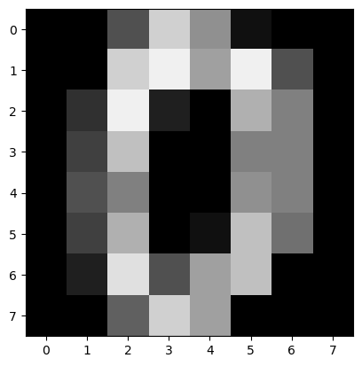
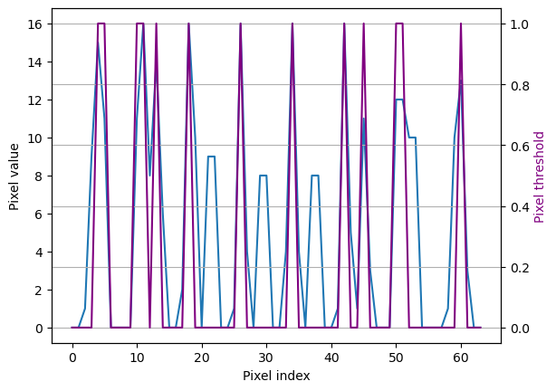
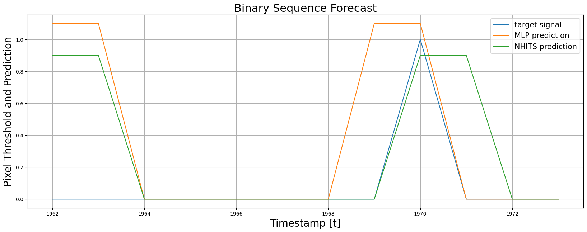

export const quartoRawHtml =
[`<div>
<style scoped>
    .dataframe tbody tr th:only-of-type {
        vertical-align: middle;
    }
    .dataframe tbody tr th {
        vertical-align: top;
    }
    .dataframe thead th {
        text-align: right;
    }
</style>
`,`
<p>6400 rows × 4 columns</p>
</div>`,`<div>
<style scoped>
    .dataframe tbody tr th:only-of-type {
        vertical-align: middle;
    }
    .dataframe tbody tr th {
        vertical-align: top;
    }
    .dataframe thead th {
        text-align: right;
    }
</style>
`,`
<p>1200 rows × 17 columns</p>
</div>`,`<div>
<style scoped>
    .dataframe tbody tr th:only-of-type {
        vertical-align: middle;
    }
    .dataframe tbody tr th {
        vertical-align: top;
    }
    .dataframe thead th {
        text-align: right;
    }
</style>
`,`
<p>1200 rows × 17 columns</p>
</div>`];

A logistic regression analyzes the relationship between a binary target
variable and its predictor variables to estimate the probability of the
dependent variable taking the value 1. In the presence of temporal data
where observations along time aren’t independent, the errors of the
model will be correlated through time and incorporating autoregressive
features or lags can capture temporal dependencies and enhance the
predictive power of logistic regression.

<br>NHITS’s inputs are static exogenous $\mathbf{x}^{(s)}$, historic
exogenous $\mathbf{x}^{(h)}_{[:t]}$, exogenous available at the time of
the prediction $\mathbf{x}^{(f)}_{[:t+H]}$ and autorregresive features
$\mathbf{y}_{[:t]}$, each of these inputs is further decomposed into
categorical and continuous. The network uses a multi-quantile regression
to model the following conditional
probability:$$\mathbb{P}(\mathbf{y}_{[t+1:t+H]}|\;\mathbf{y}_{[:t]},\; \mathbf{x}^{(h)}_{[:t]},\; \mathbf{x}^{(f)}_{[:t+H]},\; \mathbf{x}^{(s)})$$

In this notebook we show how to fit NeuralForecast methods for binary
sequences regression. We will: - Installing NeuralForecast. - Loading
binary sequence data. - Fit and predict temporal classifiers. - Plot and
evaluate predictions.

You can run these experiments using GPU with Google Colab.

<a href="https://colab.research.google.com/github/Nixtla/neuralforecast/blob/main/nbs/examples/Temporal_Classifiers.ipynb" target="_parent"></a>

## 1. Installing NeuralForecast {#installing-neuralforecast}

<details>
<summary>Code</summary>

``` python
#%%capture
#!pip install neuralforecast
```

</details>
<details>
<summary>Code</summary>

``` python
import numpy as np
import pandas as pd
from sklearn import datasets

import matplotlib.pyplot as plt
from neuralforecast import NeuralForecast
from neuralforecast.models import MLP, NHITS, LSTM
from neuralforecast.losses.pytorch import DistributionLoss, Accuracy
```

</details>

## 2. Loading Binary Sequence Data {#loading-binary-sequence-data}

The `core.NeuralForecast` class contains shared, `fit`, `predict` and
other methods that take as inputs pandas DataFrames with columns
`['unique_id', 'ds', 'y']`, where `unique_id` identifies individual time
series from the dataset, `ds` is the date, and `y` is the target binary
variable.

In this motivation example we convert 8x8 digits images into 64-length
sequences and define a classification problem, to identify when the
pixels surpass certain threshold. We declare a pandas dataframe in long
format, to match NeuralForecast’s inputs.

<details>
<summary>Code</summary>

``` python
digits = datasets.load_digits()
images = digits.images[:100]

plt.imshow(images[0,:,:], cmap=plt.cm.gray, 
           vmax=16, interpolation="nearest")

pixels = np.reshape(images, (len(images), 64))
ytarget = (pixels > 10) * 1

fig, ax1 = plt.subplots()
ax2 = ax1.twinx()
ax1.plot(pixels[10])
ax2.plot(ytarget[10], color='purple')
ax1.set_xlabel('Pixel index')
ax1.set_ylabel('Pixel value')
ax2.set_ylabel('Pixel threshold', color='purple')
plt.grid()
plt.show()
```

</details>





<details>
<summary>Code</summary>

``` python
# We flat the images and create an input dataframe
# with 'unique_id' series identifier and 'ds' time stamp identifier.
Y_df = pd.DataFrame.from_dict({
            'unique_id': np.repeat(np.arange(100), 64),
            'ds': np.tile(np.arange(64)+1910, 100),
            'y': ytarget.flatten(), 'pixels': pixels.flatten()})
Y_df
```

</details>
<div dangerouslySetInnerHTML={{ __html: quartoRawHtml[0] }} />

|      | unique_id | ds   | y   | pixels |
|------|-----------|------|-----|--------|
| 0    | 0         | 1910 | 0   | 0.0    |
| 1    | 0         | 1911 | 0   | 0.0    |
| 2    | 0         | 1912 | 0   | 5.0    |
| 3    | 0         | 1913 | 1   | 13.0   |
| 4    | 0         | 1914 | 0   | 9.0    |
| ...  | ...       | ...  | ... | ...    |
| 6395 | 99        | 1969 | 1   | 14.0   |
| 6396 | 99        | 1970 | 1   | 16.0   |
| 6397 | 99        | 1971 | 0   | 3.0    |
| 6398 | 99        | 1972 | 0   | 0.0    |
| 6399 | 99        | 1973 | 0   | 0.0    |

<div dangerouslySetInnerHTML={{ __html: quartoRawHtml[1] }} />

## 3. Fit and predict temporal classifiers {#fit-and-predict-temporal-classifiers}

### Fit the models {#fit-the-models}

Using the `NeuralForecast.fit` method you can train a set of models to
your dataset. You can define the forecasting `horizon` (12 in this
example), and modify the hyperparameters of the model. For example, for
the `NHITS` we changed the default hidden size for both encoder and
decoders.

See the `NHITS` and `MLP` [model
documentation](https://nixtla.github.io/neuralforecast/models.mlp.html).

:::warning

For the moment Recurrent-based model family is not available to operate
with Bernoulli distribution output. This affects the following methods
`LSTM`, `GRU`, `DilatedRNN`, and `TCN`. This feature is work in
progress.

:::

<details>
<summary>Code</summary>

``` python
# %%capture
horizon = 12

# Try different hyperparmeters to improve accuracy.
models = [MLP(h=horizon,                           # Forecast horizon
              input_size=2 * horizon,              # Length of input sequence
              loss=DistributionLoss('Bernoulli'),  # Binary classification loss
              valid_loss=Accuracy(),               # Accuracy validation signal
              max_steps=500,                       # Number of steps to train
              scaler_type='standard',              # Type of scaler to normalize data
              hidden_size=64,                      # Defines the size of the hidden state of the LSTM
              #early_stop_patience_steps=2,         # Early stopping regularization patience
              val_check_steps=10,                  # Frequency of validation signal (affects early stopping)
              ),
          NHITS(h=horizon,                          # Forecast horizon
                input_size=2 * horizon,             # Length of input sequence
                loss=DistributionLoss('Bernoulli'), # Binary classification loss
                valid_loss=Accuracy(),              # Accuracy validation signal                
                max_steps=500,                      # Number of steps to train
                n_freq_downsample=[2, 1, 1],        # Downsampling factors for each stack output
                #early_stop_patience_steps=2,        # Early stopping regularization patience
                val_check_steps=10,                 # Frequency of validation signal (affects early stopping)
                )             
          ]
nf = NeuralForecast(models=models, freq='Y')
Y_hat_df = nf.cross_validation(df=Y_df, n_windows=1)
```

</details>

``` text
Global seed set to 1
Global seed set to 1
```

``` text
Epoch 124: 100%|██████████| 4/4 [00:00<00:00, 50.22it/s, v_num=35, train_loss_step=0.260, train_loss_epoch=0.331]
Predicting DataLoader 0: 100%|██████████| 4/4 [00:00<00:00, 37.07it/s]
Epoch 124: 100%|██████████| 4/4 [00:00<00:00,  5.34it/s, v_num=37, train_loss_step=0.179, train_loss_epoch=0.180]
Predicting DataLoader 0: 100%|██████████| 4/4 [00:00<00:00, 49.74it/s]
```

<details>
<summary>Code</summary>

``` python
# By default NeuralForecast produces forecast intervals
# In this case the lo-x and high-x levels represent the 
# low and high bounds of the prediction accumulating x% probability
Y_hat_df = Y_hat_df.reset_index(drop=True)
Y_hat_df
```

</details>
<div dangerouslySetInnerHTML={{ __html: quartoRawHtml[2] }} />

|      | unique_id | ds   | cutoff | MLP   | MLP-median | MLP-lo-90 | MLP-lo-80 | MLP-hi-80 | MLP-hi-90 | NHITS | NHITS-median | NHITS-lo-90 | NHITS-lo-80 | NHITS-hi-80 | NHITS-hi-90 | y   | pixels |
|------|-----------|------|--------|-------|------------|-----------|-----------|-----------|-----------|-------|--------------|-------------|-------------|-------------|-------------|-----|--------|
| 0    | 0         | 1962 | 1961   | 0.190 | 0.0        | 0.0       | 0.0       | 1.0       | 1.0       | 0.422 | 0.0          | 0.0         | 0.0         | 1.0         | 1.0         | 0   | 10.0   |
| 1    | 0         | 1963 | 1961   | 0.754 | 1.0        | 0.0       | 0.0       | 1.0       | 1.0       | 0.955 | 1.0          | 1.0         | 1.0         | 1.0         | 1.0         | 1   | 12.0   |
| 2    | 0         | 1964 | 1961   | 0.035 | 0.0        | 0.0       | 0.0       | 0.0       | 0.0       | 0.000 | 0.0          | 0.0         | 0.0         | 0.0         | 0.0         | 0   | 0.0    |
| 3    | 0         | 1965 | 1961   | 0.049 | 0.0        | 0.0       | 0.0       | 0.0       | 0.0       | 0.015 | 0.0          | 0.0         | 0.0         | 0.0         | 0.0         | 0   | 0.0    |
| 4    | 0         | 1966 | 1961   | 0.042 | 0.0        | 0.0       | 0.0       | 0.0       | 0.0       | 0.000 | 0.0          | 0.0         | 0.0         | 0.0         | 0.0         | 0   | 0.0    |
| ...  | ...       | ...  | ...    | ...   | ...        | ...       | ...       | ...       | ...       | ...   | ...          | ...         | ...         | ...         | ...         | ... | ...    |
| 1195 | 99        | 1969 | 1961   | 0.484 | 0.0        | 0.0       | 0.0       | 1.0       | 1.0       | 0.817 | 1.0          | 0.0         | 0.0         | 1.0         | 1.0         | 1   | 14.0   |
| 1196 | 99        | 1970 | 1961   | 0.587 | 1.0        | 0.0       | 0.0       | 1.0       | 1.0       | 0.495 | 0.0          | 0.0         | 0.0         | 1.0         | 1.0         | 1   | 16.0   |
| 1197 | 99        | 1971 | 1961   | 0.336 | 0.0        | 0.0       | 0.0       | 1.0       | 1.0       | 0.126 | 0.0          | 0.0         | 0.0         | 1.0         | 1.0         | 0   | 3.0    |
| 1198 | 99        | 1972 | 1961   | 0.046 | 0.0        | 0.0       | 0.0       | 0.0       | 0.0       | 0.000 | 0.0          | 0.0         | 0.0         | 0.0         | 0.0         | 0   | 0.0    |
| 1199 | 99        | 1973 | 1961   | 0.001 | 0.0        | 0.0       | 0.0       | 0.0       | 0.0       | 0.000 | 0.0          | 0.0         | 0.0         | 0.0         | 0.0         | 0   | 0.0    |

<div dangerouslySetInnerHTML={{ __html: quartoRawHtml[3] }} />

<details>
<summary>Code</summary>

``` python
# Define classification threshold for final predictions
# If (prob > threshold) -> 1
Y_hat_df['NHITS'] = (Y_hat_df['NHITS'] > 0.5) * 1
Y_hat_df['MLP'] = (Y_hat_df['MLP'] > 0.5) * 1
Y_hat_df
```

</details>
<div dangerouslySetInnerHTML={{ __html: quartoRawHtml[4] }} />

|      | unique_id | ds   | cutoff | MLP | MLP-median | MLP-lo-90 | MLP-lo-80 | MLP-hi-80 | MLP-hi-90 | NHITS | NHITS-median | NHITS-lo-90 | NHITS-lo-80 | NHITS-hi-80 | NHITS-hi-90 | y   | pixels |
|------|-----------|------|--------|-----|------------|-----------|-----------|-----------|-----------|-------|--------------|-------------|-------------|-------------|-------------|-----|--------|
| 0    | 0         | 1962 | 1961   | 0   | 0.0        | 0.0       | 0.0       | 1.0       | 1.0       | 0     | 0.0          | 0.0         | 0.0         | 1.0         | 1.0         | 0   | 10.0   |
| 1    | 0         | 1963 | 1961   | 1   | 1.0        | 0.0       | 0.0       | 1.0       | 1.0       | 1     | 1.0          | 1.0         | 1.0         | 1.0         | 1.0         | 1   | 12.0   |
| 2    | 0         | 1964 | 1961   | 0   | 0.0        | 0.0       | 0.0       | 0.0       | 0.0       | 0     | 0.0          | 0.0         | 0.0         | 0.0         | 0.0         | 0   | 0.0    |
| 3    | 0         | 1965 | 1961   | 0   | 0.0        | 0.0       | 0.0       | 0.0       | 0.0       | 0     | 0.0          | 0.0         | 0.0         | 0.0         | 0.0         | 0   | 0.0    |
| 4    | 0         | 1966 | 1961   | 0   | 0.0        | 0.0       | 0.0       | 0.0       | 0.0       | 0     | 0.0          | 0.0         | 0.0         | 0.0         | 0.0         | 0   | 0.0    |
| ...  | ...       | ...  | ...    | ... | ...        | ...       | ...       | ...       | ...       | ...   | ...          | ...         | ...         | ...         | ...         | ... | ...    |
| 1195 | 99        | 1969 | 1961   | 0   | 0.0        | 0.0       | 0.0       | 1.0       | 1.0       | 1     | 1.0          | 0.0         | 0.0         | 1.0         | 1.0         | 1   | 14.0   |
| 1196 | 99        | 1970 | 1961   | 1   | 1.0        | 0.0       | 0.0       | 1.0       | 1.0       | 0     | 0.0          | 0.0         | 0.0         | 1.0         | 1.0         | 1   | 16.0   |
| 1197 | 99        | 1971 | 1961   | 0   | 0.0        | 0.0       | 0.0       | 1.0       | 1.0       | 0     | 0.0          | 0.0         | 0.0         | 1.0         | 1.0         | 0   | 3.0    |
| 1198 | 99        | 1972 | 1961   | 0   | 0.0        | 0.0       | 0.0       | 0.0       | 0.0       | 0     | 0.0          | 0.0         | 0.0         | 0.0         | 0.0         | 0   | 0.0    |
| 1199 | 99        | 1973 | 1961   | 0   | 0.0        | 0.0       | 0.0       | 0.0       | 0.0       | 0     | 0.0          | 0.0         | 0.0         | 0.0         | 0.0         | 0   | 0.0    |

<div dangerouslySetInnerHTML={{ __html: quartoRawHtml[5] }} />

## 4. Plot and Evaluate Predictions {#plot-and-evaluate-predictions}

Finally, we plot the forecasts of both models againts the real values.
And evaluate the accuracy of the `MLP` and `NHITS` temporal classifiers.

<details>
<summary>Code</summary>

``` python
plot_df = Y_hat_df[Y_hat_df.unique_id==10]

fig, ax = plt.subplots(1, 1, figsize = (20, 7))
plt.plot(plot_df.ds, plot_df.y, label='target signal')
plt.plot(plot_df.ds, plot_df['MLP'] * 1.1, label='MLP prediction')
plt.plot(plot_df.ds, plot_df['NHITS'] * .9, label='NHITS prediction')
ax.set_title('Binary Sequence Forecast', fontsize=22)
ax.set_ylabel('Pixel Threshold and Prediction', fontsize=20)
ax.set_xlabel('Timestamp [t]', fontsize=20)
ax.legend(prop={'size': 15})
ax.grid()
```

</details>



<details>
<summary>Code</summary>

``` python
def accuracy(y, y_hat):
    return np.mean(y==y_hat)

mlp_acc = accuracy(y=Y_hat_df['y'], y_hat=Y_hat_df['MLP'])
nhits_acc = accuracy(y=Y_hat_df['y'], y_hat=Y_hat_df['NHITS'])

print(f'MLP Accuracy: {mlp_acc:.1%}')
print(f'NHITS Accuracy: {nhits_acc:.1%}')
```

</details>

``` text
MLP Accuracy: 77.7%
NHITS Accuracy: 78.1%
```

## References {#references}

-   [Cox D. R. (1958). “The Regression Analysis of Binary Sequences.”
    Journal of the Royal Statistical Society B, 20(2),
    215–242.](https://arxiv.org/abs/2201.12886)
-   [Cristian Challu, Kin G. Olivares, Boris N. Oreshkin, Federico
    Garza, Max Mergenthaler-Canseco, Artur Dubrawski (2023). NHITS:
    Neural Hierarchical Interpolation for Time Series Forecasting.
    Accepted at AAAI 2023.](https://arxiv.org/abs/2201.12886)

