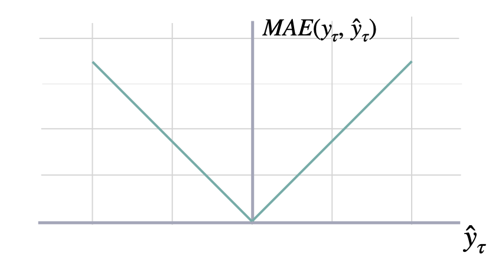
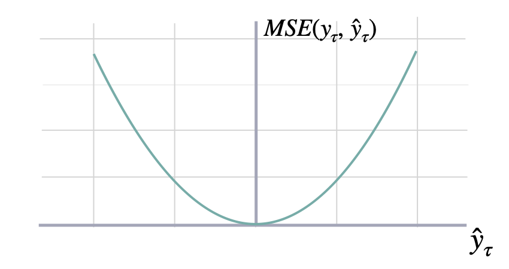
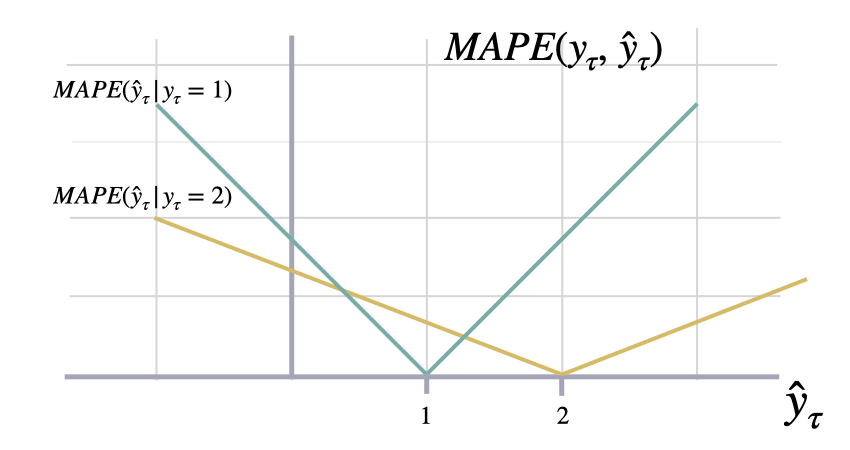
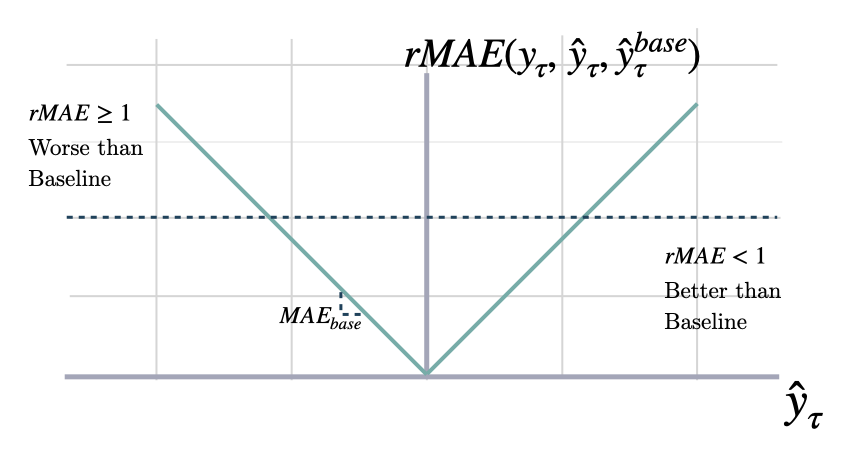
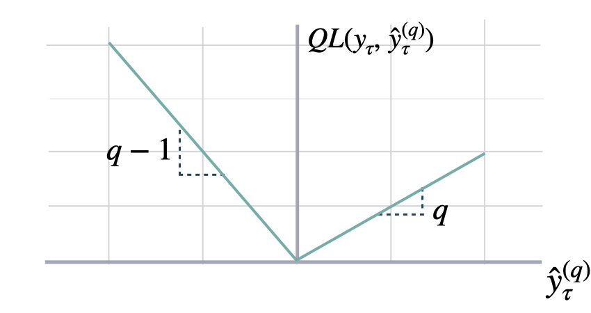

::: {.cell 0=‘h’ 1=‘i’ 2=‘d’ 3=‘e’}

<details>
<summary>Code</summary>

``` python
%load_ext autoreload
%autoreload 2
```

</details>

:::

> NeuralForecast contains a collection NumPy loss functions aimed to be
> used during the models’ evaluation. The most important train signal is
> the forecast error, which is the difference between the observed value
> $y_{\tau}$ and the prediction $\hat{y}_{\tau}$, at time
> $y_{\tau}$:$$e_{\tau} = y_{\tau}-\hat{y}_{\tau} \qquad \qquad \tau \in \{t+1,\dots,t+H \}$$
> The train loss summarizes the forecast errors in different evaluation
> metrics.<br><br>

::: {.cell 0=‘e’ 1=‘x’ 2=‘p’ 3=‘o’ 4=‘r’ 5=‘t’}

<details>
<summary>Code</summary>

``` python
from typing import Optional, Union

import numpy as np
```

</details>

:::

::: {.cell 0=‘h’ 1=‘i’ 2=‘d’ 3=‘e’}

<details>
<summary>Code</summary>

``` python
from nbdev.showdoc import show_doc
```

</details>

:::

::: {.cell 0=‘h’ 1=‘i’ 2=‘d’ 3=‘e’}

<details>
<summary>Code</summary>

``` python
from IPython.display import Image
WIDTH = 600
HEIGHT = 300
```

</details>

:::

::: {.cell 0=‘e’ 1=‘x’ 2=‘p’ 3=‘o’ 4=‘r’ 5=‘t’}

<details>
<summary>Code</summary>

``` python
def _divide_no_nan(a: np.ndarray, b: np.ndarray) -> np.ndarray:
    """
    Auxiliary funtion to handle divide by 0
    """
    div = a / b
    div[div != div] = 0.0
    div[div == float('inf')] = 0.0
    return div
```

</details>

:::

::: {.cell 0=‘e’ 1=‘x’ 2=‘p’ 3=‘o’ 4=‘r’ 5=‘t’}

<details>
<summary>Code</summary>

``` python
def _metric_protections(y: np.ndarray, y_hat: np.ndarray, 
                        weights: Optional[np.ndarray]) -> None:
    assert (weights is None) or (np.sum(weights) > 0), 'Sum of weights cannot be 0'
    assert (weights is None) or (weights.shape == y.shape),\
        f'Wrong weight dimension weights.shape {weights.shape}, y.shape {y.shape}'
```

</details>

:::

# <span style="color:DarkBlue">1. Scale-dependent Errors </span> {#scale-dependent-errors}

These metrics are on the same scale as the data.

## Mean Absolute Error {#mean-absolute-error}

::: {.cell 0=‘e’ 1=‘x’ 2=‘p’ 3=‘o’ 4=‘r’ 5=‘t’}

<details>
<summary>Code</summary>

``` python
def mae(y: np.ndarray, y_hat: np.ndarray,
        weights: Optional[np.ndarray] = None,
        axis: Optional[int] = None) -> Union[float, np.ndarray]:
    """Mean Absolute Error

    Calculates Mean Absolute Error between
    `y` and `y_hat`. MAE measures the relative prediction
    accuracy of a forecasting method by calculating the
    deviation of the prediction and the true
    value at a given time and averages these devations
    over the length of the series.

    $$ \mathrm{MAE}(\\mathbf{y}_{\\tau}, \\mathbf{\hat{y}}_{\\tau}) = \\frac{1}{H} \\sum^{t+H}_{\\tau=t+1} |y_{\\tau} - \hat{y}_{\\tau}| $$

    **Parameters:**<br>
    `y`: numpy array, Actual values.<br>
    `y_hat`: numpy array, Predicted values.<br>
    `mask`: numpy array, Specifies date stamps per serie to consider in loss.<br>

    **Returns:**<br>
    `mae`: numpy array, (single value).    
    """
    _metric_protections(y, y_hat, weights)
    
    delta_y = np.abs(y - y_hat)
    if weights is not None:
        mae = np.average(delta_y[~np.isnan(delta_y)], 
                         weights=weights[~np.isnan(delta_y)],
                         axis=axis)
    else:
        mae = np.nanmean(delta_y, axis=axis)
        
    return mae
```

</details>

:::

<details>
<summary>Code</summary>

``` python
show_doc(mae, title_level=3)
```

</details>



## Mean Squared Error {#mean-squared-error}

::: {.cell 0=‘e’ 1=‘x’ 2=‘p’ 3=‘o’ 4=‘r’ 5=‘t’}

<details>
<summary>Code</summary>

``` python
def mse(y: np.ndarray, y_hat: np.ndarray, 
        weights: Optional[np.ndarray] = None,
        axis: Optional[int] = None) -> Union[float, np.ndarray]:
    """  Mean Squared Error

    Calculates Mean Squared Error between
    `y` and `y_hat`. MSE measures the relative prediction
    accuracy of a forecasting method by calculating the 
    squared deviation of the prediction and the true
    value at a given time, and averages these devations
    over the length of the series.

    $$ \mathrm{MSE}(\\mathbf{y}_{\\tau}, \\mathbf{\hat{y}}_{\\tau}) = \\frac{1}{H} \\sum^{t+H}_{\\tau=t+1} (y_{\\tau} - \hat{y}_{\\tau})^{2} $$

    **Parameters:**<br>
    `y`: numpy array, Actual values.<br>
    `y_hat`: numpy array, Predicted values.<br>
    `mask`: numpy array, Specifies date stamps per serie to consider in loss.<br>

    **Returns:**<br>
    `mse`: numpy array, (single value).
    """
    _metric_protections(y, y_hat, weights)

    delta_y = np.square(y - y_hat)
    if weights is not None:
        mse = np.average(delta_y[~np.isnan(delta_y)],
                         weights=weights[~np.isnan(delta_y)],
                         axis=axis)
    else:
        mse = np.nanmean(delta_y, axis=axis)

    return mse
```

</details>

:::

<details>
<summary>Code</summary>

``` python
show_doc(mse, title_level=3)
```

</details>



## Root Mean Squared Error {#root-mean-squared-error}

::: {.cell 0=‘e’ 1=‘x’ 2=‘p’ 3=‘o’ 4=‘r’ 5=‘t’}

<details>
<summary>Code</summary>

``` python
def rmse(y: np.ndarray, y_hat: np.ndarray,
         weights: Optional[np.ndarray] = None,
         axis: Optional[int] = None) -> Union[float, np.ndarray]:
    """ Root Mean Squared Error

    Calculates Root Mean Squared Error between
    `y` and `y_hat`. RMSE measures the relative prediction
    accuracy of a forecasting method by calculating the squared deviation
    of the prediction and the observed value at a given time and
    averages these devations over the length of the series.
    Finally the RMSE will be in the same scale
    as the original time series so its comparison with other
    series is possible only if they share a common scale.
    RMSE has a direct connection to the L2 norm.

    $$ \mathrm{RMSE}(\\mathbf{y}_{\\tau}, \\mathbf{\hat{y}}_{\\tau}) = \\sqrt{\\frac{1}{H} \\sum^{t+H}_{\\tau=t+1} (y_{\\tau} - \hat{y}_{\\tau})^{2}} $$

    **Parameters:**<br>
    `y`: numpy array, Actual values.<br>
    `y_hat`: numpy array, Predicted values.<br>
    `mask`: numpy array, Specifies date stamps per serie to consider in loss.<br>

    **Returns:**<br>
    `rmse`: numpy array, (single value).
    """
    return np.sqrt(mse(y, y_hat, weights, axis))
```

</details>

:::

<details>
<summary>Code</summary>

``` python
show_doc(rmse, title_level=3)
```

</details>


# <span style="color:DarkBlue"> 2. Percentage errors </span> {#percentage-errors}

These metrics are unit-free, suitable for comparisons across series.

## Mean Absolute Percentage Error {#mean-absolute-percentage-error}

::: {.cell 0=‘e’ 1=‘x’ 2=‘p’ 3=‘o’ 4=‘r’ 5=‘t’}

<details>
<summary>Code</summary>

``` python
def mape(y: np.ndarray, y_hat: np.ndarray, 
         weights: Optional[np.ndarray] = None,
         axis: Optional[int] = None) -> Union[float, np.ndarray]:
    """ Mean Absolute Percentage Error

    Calculates Mean Absolute Percentage Error  between
    `y` and `y_hat`. MAPE measures the relative prediction
    accuracy of a forecasting method by calculating the percentual deviation
    of the prediction and the observed value at a given time and
    averages these devations over the length of the series.
    The closer to zero an observed value is, the higher penalty MAPE loss
    assigns to the corresponding error.

    $$ \mathrm{MAPE}(\\mathbf{y}_{\\tau}, \\mathbf{\hat{y}}_{\\tau}) = \\frac{1}{H} \\sum^{t+H}_{\\tau=t+1} \\frac{|y_{\\tau}-\hat{y}_{\\tau}|}{|y_{\\tau}|} $$

    **Parameters:**<br>
    `y`: numpy array, Actual values.<br>
    `y_hat`: numpy array, Predicted values.<br>
    `mask`: numpy array, Specifies date stamps per serie to consider in loss.<br>

    **Returns:**<br>
    `mape`: numpy array, (single value).
    """
    _metric_protections(y, y_hat, weights)
        
    delta_y = np.abs(y - y_hat)
    scale = np.abs(y)
    mape = _divide_no_nan(delta_y, scale)
    mape = np.average(mape, weights=weights, axis=axis)
    
    return mape
```

</details>

:::

<details>
<summary>Code</summary>

``` python
show_doc(mape, title_level=3)
```

</details>



## SMAPE {#smape}

::: {.cell 0=‘e’ 1=‘x’ 2=‘p’ 3=‘o’ 4=‘r’ 5=‘t’}

<details>
<summary>Code</summary>

``` python
def smape(y: np.ndarray, y_hat: np.ndarray,
          weights: Optional[np.ndarray] = None,
          axis: Optional[int] = None) -> Union[float, np.ndarray]:
    """ Symmetric Mean Absolute Percentage Error

    Calculates Symmetric Mean Absolute Percentage Error between
    `y` and `y_hat`. SMAPE measures the relative prediction
    accuracy of a forecasting method by calculating the relative deviation
    of the prediction and the observed value scaled by the sum of the
    absolute values for the prediction and observed value at a
    given time, then averages these devations over the length
    of the series. This allows the SMAPE to have bounds between
    0% and 200% which is desirable compared to normal MAPE that
    may be undetermined when the target is zero.

    $$ \mathrm{sMAPE}_{2}(\\mathbf{y}_{\\tau}, \\mathbf{\hat{y}}_{\\tau}) = \\frac{1}{H} \\sum^{t+H}_{\\tau=t+1} \\frac{|y_{\\tau}-\hat{y}_{\\tau}|}{|y_{\\tau}|+|\hat{y}_{\\tau}|} $$

    **Parameters:**<br>
    `y`: numpy array, Actual values.<br>
    `y_hat`: numpy array, Predicted values.<br>
    `mask`: numpy array, Specifies date stamps per serie to consider in loss.<br>

    **Returns:**<br>
    `smape`: numpy array, (single value).
    
    **References:**<br>
    [Makridakis S., "Accuracy measures: theoretical and practical concerns".](https://www.sciencedirect.com/science/article/pii/0169207093900793)
    """
    _metric_protections(y, y_hat, weights)
        
    delta_y = np.abs(y - y_hat)
    scale = np.abs(y) + np.abs(y_hat)
    smape = _divide_no_nan(delta_y, scale)
    smape = 2 * np.average(smape, weights=weights, axis=axis)
    
    if isinstance(smape, float):
        assert smape <= 2, 'SMAPE should be lower than 200'
    else:
        assert all(smape <= 2), 'SMAPE should be lower than 200'
    
    return smape
```

</details>

:::

<details>
<summary>Code</summary>

``` python
show_doc(smape, title_level=3)
```

</details>

# <span style="color:DarkBlue"> 3. Scale-independent Errors </span> {#scale-independent-errors}

These metrics measure the relative improvements versus baselines.

## Mean Absolute Scaled Error {#mean-absolute-scaled-error}

::: {.cell 0=‘e’ 1=‘x’ 2=‘p’ 3=‘o’ 4=‘r’ 5=‘t’}

<details>
<summary>Code</summary>

``` python
def mase(y: np.ndarray, y_hat: np.ndarray, 
         y_train: np.ndarray,
         seasonality: int,
         weights: Optional[np.ndarray] = None,
         axis: Optional[int] = None) -> Union[float, np.ndarray]:
    """ Mean Absolute Scaled Error 
    Calculates the Mean Absolute Scaled Error between
    `y` and `y_hat`. MASE measures the relative prediction
    accuracy of a forecasting method by comparinng the mean absolute errors
    of the prediction and the observed value against the mean
    absolute errors of the seasonal naive model.
    The MASE partially composed the Overall Weighted Average (OWA), 
    used in the M4 Competition.

    $$ \mathrm{MASE}(\\mathbf{y}_{\\tau}, \\mathbf{\hat{y}}_{\\tau}, \\mathbf{\hat{y}}^{season}_{\\tau}) = \\frac{1}{H} \sum^{t+H}_{\\tau=t+1} \\frac{|y_{\\tau}-\hat{y}_{\\tau}|}{\mathrm{MAE}(\\mathbf{y}_{\\tau}, \\mathbf{\hat{y}}^{season}_{\\tau})} $$

    **Parameters:**<br>
    `y`: numpy array, (batch_size, output_size), Actual values.<br>
    `y_hat`: numpy array, (batch_size, output_size)), Predicted values.<br>
    `y_insample`: numpy array, (batch_size, input_size), Actual insample Seasonal Naive predictions.<br>
    `seasonality`: int. Main frequency of the time series; Hourly 24,  Daily 7, Weekly 52, Monthly 12, Quarterly 4, Yearly 1.        
    `mask`: numpy array, Specifies date stamps per serie to consider in loss.<br>

    **Returns:**<br>
    `mase`: numpy array, (single value).
    
    **References:**<br>
    [Rob J. Hyndman, & Koehler, A. B. "Another look at measures of forecast accuracy".](https://www.sciencedirect.com/science/article/pii/S0169207006000239)<br>
    [Spyros Makridakis, Evangelos Spiliotis, Vassilios Assimakopoulos, "The M4 Competition: 100,000 time series and 61 forecasting methods".](https://www.sciencedirect.com/science/article/pii/S0169207019301128)
    """
    delta_y = np.abs(y - y_hat)
    delta_y = np.average(delta_y, weights=weights, axis=axis)

    scale = np.abs(y_train[:-seasonality] - y_train[seasonality:])
    scale = np.average(scale, axis=axis)

    mase = delta_y / scale

    return mase
```

</details>

:::

<details>
<summary>Code</summary>

``` python
show_doc(mase, title_level=3)
```

</details>


## Relative Mean Absolute Error {#relative-mean-absolute-error}

::: {.cell 0=‘e’ 1=‘x’ 2=‘p’ 3=‘o’ 4=‘r’ 5=‘t’}

<details>
<summary>Code</summary>

``` python
def rmae(y: np.ndarray, 
         y_hat1: np.ndarray, y_hat2: np.ndarray, 
         weights: Optional[np.ndarray] = None,
         axis: Optional[int] = None) -> Union[float, np.ndarray]:
    """ RMAE
            
    Calculates Relative Mean Absolute Error (RMAE) between
    two sets of forecasts (from two different forecasting methods).
    A number smaller than one implies that the forecast in the 
    numerator is better than the forecast in the denominator.
    
    $$ \mathrm{rMAE}(\\mathbf{y}_{\\tau}, \\mathbf{\hat{y}}_{\\tau}, \\mathbf{\hat{y}}^{base}_{\\tau}) = \\frac{1}{H} \sum^{t+H}_{\\tau=t+1} \\frac{|y_{\\tau}-\hat{y}_{\\tau}|}{\mathrm{MAE}(\\mathbf{y}_{\\tau}, \\mathbf{\hat{y}}^{base}_{\\tau})} $$
    
    **Parameters:**<br>
    `y`: numpy array, observed values.<br>
    `y_hat1`: numpy array. Predicted values of first model.<br>
    `y_hat2`: numpy array. Predicted values of baseline model.<br>
    `weights`: numpy array, optional. Weights for weighted average.<br>
    `axis`: None or int, optional.Axis or axes along which to average a.<br> 
        The default, axis=None, will average over all of the elements of
        the input array.
    
    **Returns:**<br>
    `rmae`: numpy array or double.

    **References:**<br>
    [Rob J. Hyndman, & Koehler, A. B. "Another look at measures of forecast accuracy".](https://www.sciencedirect.com/science/article/pii/S0169207006000239)
    """
    numerator = mae(y=y, y_hat=y_hat1, weights=weights, axis=axis)
    denominator = mae(y=y, y_hat=y_hat2, weights=weights, axis=axis)
    rmae = numerator / denominator

    return rmae
```

</details>

:::

<details>
<summary>Code</summary>

``` python
show_doc(rmae, title_level=3)
```

</details>



# <span style="color:DarkBlue"> 4. Probabilistic Errors </span> {#probabilistic-errors}

These measure absolute deviation non-symmetrically, that produce
under/over estimation.

## Quantile Loss {#quantile-loss}

::: {.cell 0=‘e’ 1=‘x’ 2=‘p’ 3=‘o’ 4=‘r’ 5=‘t’}

<details>
<summary>Code</summary>

``` python
def quantile_loss(y: np.ndarray, y_hat: np.ndarray, q: float = 0.5, 
                  weights: Optional[np.ndarray] = None,
                  axis: Optional[int] = None) -> Union[float, np.ndarray]:
    """ Quantile Loss

    Computes the quantile loss between `y` and `y_hat`.
    QL measures the deviation of a quantile forecast.
    By weighting the absolute deviation in a non symmetric way, the
    loss pays more attention to under or over estimation.
    A common value for q is 0.5 for the deviation from the median (Pinball loss).

    $$ \mathrm{QL}(\\mathbf{y}_{\\tau}, \\mathbf{\hat{y}}^{(q)}_{\\tau}) = \\frac{1}{H} \\sum^{t+H}_{\\tau=t+1} \Big( (1-q)\,( \hat{y}^{(q)}_{\\tau} - y_{\\tau} )_{+} + q\,( y_{\\tau} - \hat{y}^{(q)}_{\\tau} )_{+} \Big) $$

    **Parameters:**<br>
    `y`: numpy array, Actual values.<br>
    `y_hat`: numpy array, Predicted values.<br>
    `q`: float, between 0 and 1. The slope of the quantile loss, in the context of quantile regression, the q determines the conditional quantile level.<br>
    `mask`: numpy array, Specifies date stamps per serie to consider in loss.<br>

    **Returns:**<br>
    `quantile_loss`: numpy array, (single value).
    
    **References:**<br>
    [Roger Koenker and Gilbert Bassett, Jr., "Regression Quantiles".](https://www.jstor.org/stable/1913643)
    """
    _metric_protections(y, y_hat, weights)

    delta_y = y - y_hat
    loss = np.maximum(q * delta_y, (q - 1) * delta_y)

    if weights is not None:
        quantile_loss = np.average(loss[~np.isnan(loss)], 
                             weights=weights[~np.isnan(loss)],
                             axis=axis)
    else:
        quantile_loss = np.nanmean(loss, axis=axis)
        
    return quantile_loss
```

</details>

:::

<details>
<summary>Code</summary>

``` python
show_doc(quantile_loss, title_level=3)
```

</details>



## Multi-Quantile Loss {#multi-quantile-loss}

::: {.cell 0=‘e’ 1=‘x’ 2=‘p’ 3=‘o’ 4=‘r’ 5=‘t’}

<details>
<summary>Code</summary>

``` python
def mqloss(y: np.ndarray, y_hat: np.ndarray, 
           quantiles: np.ndarray, 
           weights: Optional[np.ndarray] = None,
           axis: Optional[int] = None) -> Union[float, np.ndarray]:
    """  Multi-Quantile loss

    Calculates the Multi-Quantile loss (MQL) between `y` and `y_hat`.
    MQL calculates the average multi-quantile Loss for
    a given set of quantiles, based on the absolute 
    difference between predicted quantiles and observed values.

    $$ \mathrm{MQL}(\\mathbf{y}_{\\tau},[\\mathbf{\hat{y}}^{(q_{1})}_{\\tau}, ... ,\hat{y}^{(q_{n})}_{\\tau}]) = \\frac{1}{n} \\sum_{q_{i}} \mathrm{QL}(\\mathbf{y}_{\\tau}, \\mathbf{\hat{y}}^{(q_{i})}_{\\tau}) $$

    The limit behavior of MQL allows to measure the accuracy 
    of a full predictive distribution $\mathbf{\hat{F}}_{\\tau}$ with 
    the continuous ranked probability score (CRPS). This can be achieved 
    through a numerical integration technique, that discretizes the quantiles 
    and treats the CRPS integral with a left Riemann approximation, averaging over 
    uniformly distanced quantiles.    

    $$ \mathrm{CRPS}(y_{\\tau}, \mathbf{\hat{F}}_{\\tau}) = \int^{1}_{0} \mathrm{QL}(y_{\\tau}, \hat{y}^{(q)}_{\\tau}) dq $$

    **Parameters:**<br>
    `y`: numpy array, Actual values.<br>
    `y_hat`: numpy array, Predicted values.<br>
    `quantiles`: numpy array,(n_quantiles). Quantiles to estimate from the distribution of y.<br>
    `mask`: numpy array, Specifies date stamps per serie to consider in loss.<br>

    **Returns:**<br>
    `mqloss`: numpy array, (single value).
    
    **References:**<br>
    [Roger Koenker and Gilbert Bassett, Jr., "Regression Quantiles".](https://www.jstor.org/stable/1913643)<br>
    [James E. Matheson and Robert L. Winkler, "Scoring Rules for Continuous Probability Distributions".](https://www.jstor.org/stable/2629907)
    """
    if weights is None: weights = np.ones(y.shape)
        
    _metric_protections(y, y_hat, weights)
    n_q = len(quantiles)
    
    y_rep  = np.expand_dims(y, axis=-1)
    error  = y_hat - y_rep
    sq     = np.maximum(-error, np.zeros_like(error))
    s1_q   = np.maximum(error, np.zeros_like(error))
    mqloss = (quantiles * sq + (1 - quantiles) * s1_q)
    
    # Match y/weights dimensions and compute weighted average
    weights = np.repeat(np.expand_dims(weights, axis=-1), repeats=n_q, axis=-1)
    mqloss  = np.average(mqloss, weights=weights, axis=axis)

    return mqloss
```

</details>

:::

<details>
<summary>Code</summary>

``` python
show_doc(mqloss, title_level=3)
```

</details>


# <span style="color:DarkBlue"> Examples and Validation </span> {#examples-and-validation}

<details>
<summary>Code</summary>

``` python
import unittest
import torch as t 
import numpy as np

from neuralforecast.losses.pytorch import (
    MAE, MSE, RMSE,      # unscaled errors
    MAPE, SMAPE,         # percentage errors
    MASE,                # scaled error
    QuantileLoss, MQLoss # probabilistic errors
)

from neuralforecast.losses.numpy import (
    mae, mse, rmse,              # unscaled errors
    mape, smape,                 # percentage errors
    mase,                        # scaled error
    quantile_loss, mqloss        # probabilistic errors
)
```

</details>

::: {.cell 0=‘h’ 1=‘i’ 2=‘d’ 3=‘e’}

<details>
<summary>Code</summary>

``` python
# Test class for pytorch/numpy loss functions
class TestLoss(unittest.TestCase):
    def setUp(self):   
        self.num_quantiles = np.random.randint(3, 10)
        self.first_num = np.random.randint(1, 300)
        self.second_num = np.random.randint(1, 300)
        
        self.y = t.rand(self.first_num, self.second_num)
        self.y_hat = t.rand(self.first_num, self.second_num)
        self.y_hat2 = t.rand(self.first_num, self.second_num)
        self.y_hat_quantile = t.rand(self.first_num, self.second_num, self.num_quantiles)
        
        self.quantiles = t.rand(self.num_quantiles)
        self.q_float = np.random.random_sample()

    def test_mae(self):
        mae_numpy   = mae(self.y, self.y_hat)
        mae_pytorch = MAE()
        mae_pytorch = mae_pytorch(self.y, self.y_hat).numpy()
        self.assertAlmostEqual(mae_numpy, mae_pytorch, places=6)

    def test_mse(self):
        mse_numpy   = mse(self.y, self.y_hat)
        mse_pytorch = MSE()
        mse_pytorch = mse_pytorch(self.y, self.y_hat).numpy()
        self.assertAlmostEqual(mse_numpy, mse_pytorch, places=6)

    def test_rmse(self):
        rmse_numpy   = rmse(self.y, self.y_hat)
        rmse_pytorch = RMSE()
        rmse_pytorch = rmse_pytorch(self.y, self.y_hat).numpy()
        self.assertAlmostEqual(rmse_numpy, rmse_pytorch, places=6)

    def test_mape(self):
        mape_numpy   = mape(y=self.y, y_hat=self.y_hat)
        mape_pytorch = MAPE()
        mape_pytorch = mape_pytorch(y=self.y, y_hat=self.y_hat).numpy()
        self.assertAlmostEqual(mape_numpy, mape_pytorch, places=6)

    def test_smape(self):
        smape_numpy   = smape(self.y, self.y_hat)
        smape_pytorch = SMAPE()
        smape_pytorch = smape_pytorch(self.y, self.y_hat).numpy()
        self.assertAlmostEqual(smape_numpy, smape_pytorch, places=4)
    
    #def test_mase(self):
    #    y_insample = t.rand(self.first_num, self.second_num)
    #    seasonality = 24
    #    # Hourly 24, Daily 7, Weekly 52
    #    # Monthly 12, Quarterly 4, Yearly 1
    #    mase_numpy   = mase(y=self.y, y_hat=self.y_hat,
    #                        y_insample=y_insample, seasonality=seasonality)
    #    mase_object  = MASE(seasonality=seasonality)
    #    mase_pytorch = mase_object(y=self.y, y_hat=self.y_hat,
    #                               y_insample=y_insample).numpy()
    #    self.assertAlmostEqual(mase_numpy, mase_pytorch, places=2)

    #def test_rmae(self):
    #    rmae_numpy   = rmae(self.y, self.y_hat, self.y_hat2)
    #    rmae_object  = RMAE()
    #    rmae_pytorch = rmae_object(self.y, self.y_hat, self.y_hat2).numpy()
    #    self.assertAlmostEqual(rmae_numpy, rmae_pytorch, places=4)

    def test_quantile(self):
        quantile_numpy = quantile_loss(self.y, self.y_hat, q = self.q_float)
        quantile_pytorch = QuantileLoss(q = self.q_float)
        quantile_pytorch = quantile_pytorch(self.y, self.y_hat).numpy()
        self.assertAlmostEqual(quantile_numpy, quantile_pytorch, places=6)
    
#     def test_mqloss(self):
#         weights = np.ones_like(self.y)

#         mql_np_w = mqloss(self.y, self.y_hat_quantile, self.quantiles, weights=weights)
#         mql_np_default_w = mqloss(self.y, self.y_hat_quantile, self.quantiles)

#         mql_object = MQLoss(quantiles=self.quantiles)
#         mql_py_w = mql_object(y=self.y,
#                               y_hat=self.y_hat_quantile,
#                               mask=t.Tensor(weights)).numpy()
        
#         print('self.y.shape', self.y.shape)
#         print('self.y_hat_quantile.shape', self.y_hat_quantile.shape)
#         mql_py_default_w = mql_object(y=self.y,
#                                       y_hat=self.y_hat_quantile).numpy()

#         weights[0,:] = 0
#         mql_np_new_w = mqloss(self.y, self.y_hat_quantile, self.quantiles, weights=weights)
#         mql_py_new_w = mql_object(y=self.y,
#                                   y_hat=self.y_hat_quantile,
#                                   mask=t.Tensor(weights)).numpy()

#         self.assertAlmostEqual(mql_np_w,  mql_np_default_w)
#         self.assertAlmostEqual(mql_py_w,  mql_py_default_w)
#         self.assertAlmostEqual(mql_np_new_w,  mql_py_new_w)
    

unittest.main(argv=[''], verbosity=2, exit=False)
```

</details>

:::

