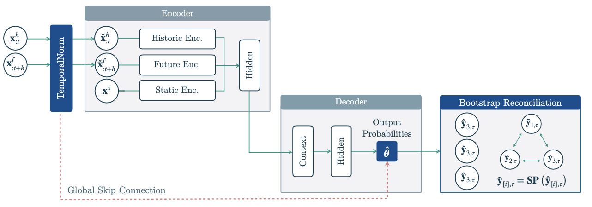
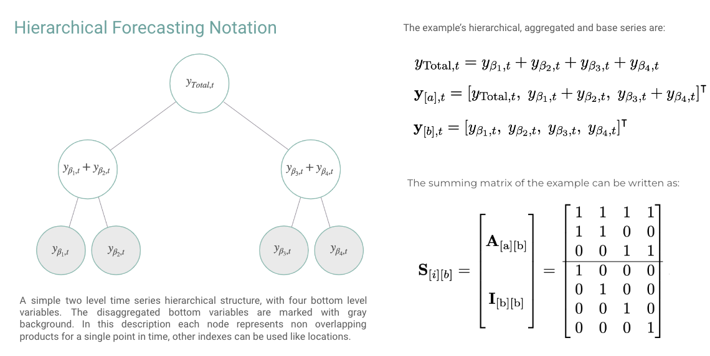

The Hierarchical Mixture Networks (HINT) are a highly modular framework
that combines SoTA neural forecast architectures with task-specialized
mixture probability and advanced hierarchical reconciliation strategies.
This powerful combination allows HINT to produce accurate and coherent
probabilistic forecasts.

HINT’s incorporates a `TemporalNorm` module into any neural forecast
architecture, the module normalizes inputs into the network’s
non-linearities operating range and recomposes its output’s scales
through a global skip connection, improving accuracy and training
robustness. HINT ensures the forecast coherence via bootstrap sample
reconciliation that restores the aggregation constraints into its base
samples.

**References**<br> - [Kin G. Olivares, David Luo, Cristian Challu,
Stefania La Vattiata, Max Mergenthaler, Artur Dubrawski (2023). “HINT:
Hierarchical Mixture Networks For Coherent Probabilistic Forecasting”.
Neural Information Processing Systems, submitted. Working Paper version
available at arxiv.](https://arxiv.org/abs/2305.07089)<br> - [Kin G.
Olivares, O. Nganba Meetei, Ruijun Ma, Rohan Reddy, Mengfei Cao, Lee
Dicker (2022).”Probabilistic Hierarchical Forecasting with Deep Poisson
Mixtures”. International Journal Forecasting, accepted paper available
at arxiv.](https://arxiv.org/pdf/2110.13179.pdf)<br> - [Kin G. Olivares,
Federico Garza, David Luo, Cristian Challu, Max Mergenthaler, Souhaib
Ben Taieb, Shanika Wickramasuriya, and Artur Dubrawski (2022).
“HierarchicalForecast: A reference framework for hierarchical
forecasting in python”. Journal of Machine Learning Research, submitted,
abs/2207.03517, 2022b.](https://arxiv.org/abs/2207.03517)



::: {.cell 0=‘h’ 1=‘i’ 2=‘d’ 3=‘e’}

<details>
<summary>Code</summary>

``` python
import os
os.environ["PYTORCH_ENABLE_MPS_FALLBACK"] = "1"

from nbdev.showdoc import show_doc
from neuralforecast.losses.pytorch import GMM
from neuralforecast import NeuralForecast
from neuralforecast.models import NHITS
import pandas as pd
```

</details>

:::

::: {.cell 0=‘e’ 1=‘x’ 2=‘p’ 3=‘o’ 4=‘r’ 5=‘t’}

<details>
<summary>Code</summary>

``` python
from typing import Optional

import numpy as np
import torch
```

</details>

:::

## Reconciliation Methods {#reconciliation-methods}

::: {.cell 0=‘e’ 1=‘x’ 2=‘p’ 3=‘o’ 4=‘r’ 5=‘t’}

<details>
<summary>Code</summary>

``` python
def get_bottomup_P(S: np.ndarray):
    """BottomUp Reconciliation Matrix.

    Creates BottomUp hierarchical \"projection\" matrix is defined as:
    $$\mathbf{P}_{\\text{BU}} = [\mathbf{0}_{\mathrm{[b],[a]}}\;|\;\mathbf{I}_{\mathrm{[b][b]}}]$$    

    **Parameters:**<br>
    `S`: Summing matrix of size (`base`, `bottom`).<br>

    **Returns:**<br>
    `P`: Reconciliation matrix of size (`bottom`, `base`).<br>

    **References:**<br>
    - [Orcutt, G.H., Watts, H.W., & Edwards, J.B.(1968). \"Data aggregation and information loss\". The American 
    Economic Review, 58 , 773{787)](http://www.jstor.org/stable/1815532).    
    """
    n_series = len(S)
    n_agg = n_series-S.shape[1]
    P = np.zeros_like(S)
    P[n_agg:,:] = S[n_agg:,:]
    P = P.T
    return P

def get_mintrace_ols_P(S: np.ndarray):
    """MinTraceOLS Reconciliation Matrix.

    Creates MinTraceOLS reconciliation matrix as proposed by Wickramasuriya et al.

    $$\mathbf{P}_{\\text{MinTraceOLS}}=\\left(\mathbf{S}^{\intercal}\mathbf{S}\\right)^{-1}\mathbf{S}^{\intercal}$$

    **Parameters:**<br>
    `S`: Summing matrix of size (`base`, `bottom`).<br>
      
    **Returns:**<br>
    `P`: Reconciliation matrix of size (`bottom`, `base`).<br>

    **References:**<br>
    - [Wickramasuriya, S.L., Turlach, B.A. & Hyndman, R.J. (2020). \"Optimal non-negative
    forecast reconciliation". Stat Comput 30, 1167–1182,
    https://doi.org/10.1007/s11222-020-09930-0](https://robjhyndman.com/publications/nnmint/).
    """
    n_hiers, n_bottom = S.shape
    n_agg = n_hiers - n_bottom

    W = np.eye(n_hiers)

    # We compute reconciliation matrix with
    # Equation 10 from https://robjhyndman.com/papers/MinT.pdf
    A = S[:n_agg,:]
    U = np.hstack((np.eye(n_agg), -A)).T
    J = np.hstack((np.zeros((n_bottom,n_agg)), np.eye(n_bottom)))
    P = J - (J @ W @ U) @ np.linalg.pinv(U.T @ W @ U) @ U.T
    return P

def get_mintrace_wls_P(S: np.ndarray):
    """MinTraceOLS Reconciliation Matrix.

    Creates MinTraceOLS reconciliation matrix as proposed by Wickramasuriya et al.
    Depending on a weighted GLS estimator and an estimator of the covariance matrix of the coherency errors $\mathbf{W}_{h}$.

    $$ \mathbf{W}_{h} = \mathrm{Diag}(\mathbf{S} \mathbb{1}_{[b]})$$

    $$\mathbf{P}_{\\text{MinTraceWLS}}=\\left(\mathbf{S}^{\intercal}\mathbf{W}_{h}\mathbf{S}\\right)^{-1}
    \mathbf{S}^{\intercal}\mathbf{W}^{-1}_{h}$$    

    **Parameters:**<br>
    `S`: Summing matrix of size (`base`, `bottom`).<br>
      
    **Returns:**<br>
    `P`: Reconciliation matrix of size (`bottom`, `base`).<br>

    **References:**<br>
    - [Wickramasuriya, S.L., Turlach, B.A. & Hyndman, R.J. (2020). \"Optimal non-negative
    forecast reconciliation". Stat Comput 30, 1167–1182,
    https://doi.org/10.1007/s11222-020-09930-0](https://robjhyndman.com/publications/nnmint/).
    """
    n_hiers, n_bottom = S.shape
    n_agg = n_hiers - n_bottom
    
    W = np.diag(S @ np.ones((n_bottom,)))

    # We compute reconciliation matrix with
    # Equation 10 from https://robjhyndman.com/papers/MinT.pdf
    A = S[:n_agg,:]
    U = np.hstack((np.eye(n_agg), -A)).T
    J = np.hstack((np.zeros((n_bottom,n_agg)), np.eye(n_bottom)))
    P = J - (J @ W @ U) @ np.linalg.pinv(U.T @ W @ U) @ U.T
    return P

def get_identity_P(S: np.ndarray):
    # Placeholder function for identity P (no reconciliation).
    pass
```

</details>

:::

<details>
<summary>Code</summary>

``` python
show_doc(get_bottomup_P, title_level=3)
```

</details>
<details>
<summary>Code</summary>

``` python
show_doc(get_mintrace_ols_P, title_level=3)
```

</details>
<details>
<summary>Code</summary>

``` python
show_doc(get_mintrace_wls_P, title_level=3)
```

</details>

## HINT {#hint}

::: {.cell 0=‘e’ 1=‘x’ 2=‘p’ 3=‘o’ 4=‘r’ 5=‘t’}

<details>
<summary>Code</summary>

``` python
class HINT:
    """ HINT

    The Hierarchical Mixture Networks (HINT) are a highly modular framework that 
    combines SoTA neural forecast architectures with a task-specialized mixture 
    probability and advanced hierarchical reconciliation strategies. This powerful 
    combination allows HINT to produce accurate and coherent probabilistic forecasts.

    HINT's incorporates a `TemporalNorm` module into any neural forecast architecture, 
    the module normalizes inputs into the network's non-linearities operating range 
    and recomposes its output's scales through a global skip connection, improving 
    accuracy and training robustness. HINT ensures the forecast coherence via bootstrap 
    sample reconciliation that restores the aggregation constraints into its base samples.

    Available reconciliations:<br>
    - BottomUp<br>
    - MinTraceOLS<br>
    - MinTraceWLS<br>
    - Identity

    **Parameters:**<br>
    `h`: int, Forecast horizon. <br>
    `model`: NeuralForecast model, instantiated model class from [architecture collection](https://nixtla.github.io/neuralforecast/models.pytorch.html).<br>
    `S`: np.ndarray, dumming matrix of size (`base`, `bottom`) see HierarchicalForecast's [aggregate method](https://nixtla.github.io/hierarchicalforecast/utils.html#aggregate).<br>
    `reconciliation`: str, HINT's reconciliation method from ['BottomUp', 'MinTraceOLS', 'MinTraceWLS'].<br>
    `alias`: str, optional,  Custom name of the model.<br>
    """
    def __init__(self,
                 h: int,
                 S: np.ndarray,
                 model,
                 reconciliation: str,
                 alias: Optional[str] = None):
        
        if model.h != h:
            raise Exception(f"Model h {model.h} does not match HINT h {h}")
        
        if not model.loss.is_distribution_output:
            raise Exception(f"The NeuralForecast model's loss {model.loss} is not a probabilistic objective")
        
        self.h = h
        self.model = model
        self.early_stop_patience_steps = model.early_stop_patience_steps
        self.S = S
        self.reconciliation = reconciliation
        self.loss = model.loss

        available_reconciliations = dict(
                                BottomUp=get_bottomup_P,
                                MinTraceOLS=get_mintrace_ols_P,
                                MinTraceWLS=get_mintrace_wls_P,
                                Identity=get_identity_P,
                                )

        if reconciliation not in available_reconciliations:
            raise Exception(f"Reconciliation {reconciliation} not available")

        # Get SP matrix
        self.reconciliation = reconciliation
        if reconciliation== 'Identity':
            self.SP = None
        else:
            P = available_reconciliations[reconciliation](S=S)
            self.SP = S @ P

        qs = torch.Tensor((np.arange(self.loss.num_samples)/self.loss.num_samples))
        self.sample_quantiles = torch.nn.Parameter(qs, requires_grad=False)
        self.alias = alias
    
    def __repr__(self):
        return type(self).__name__ if self.alias is None else self.alias


    def fit(self, dataset, val_size=0, test_size=0, random_seed=None):
        """ HINT.fit

        HINT trains on the entire hierarchical dataset, by minimizing a composite log likelihood objective.
        HINT framework integrates `TemporalNorm` into the neural forecast architecture for a scale-decoupled 
        optimization that robustifies cross-learning the hierachy's series scales.

        **Parameters:**<br>
        `dataset`: NeuralForecast's `TimeSeriesDataset` see details [here](https://nixtla.github.io/neuralforecast/tsdataset.html)<br>
        `val_size`: int, size of the validation set, (default 0).<br>
        `test_size`: int, size of the test set, (default 0).<br>
        `random_seed`: int, random seed for the prediction.<br>

        **Returns:**<br>
        `self`: A fitted base `NeuralForecast` model.<br>
        """
        self.model.fit(dataset=dataset,
                       val_size=val_size,
                       test_size=test_size,
                       random_seed=random_seed)

    def predict(self, dataset, step_size=1, random_seed=None, **data_module_kwargs):
        """ HINT.predict

        After fitting a base model on the entire hierarchical dataset.
        HINT restores the hierarchical aggregation constraints using 
        bootstrapped sample reconciliation.

        **Parameters:**<br>
        `dataset`: NeuralForecast's `TimeSeriesDataset` see details [here](https://nixtla.github.io/neuralforecast/tsdataset.html)<br>
        `step_size`: int, steps between sequential predictions, (default 1).<br>
        `random_seed`: int, random seed for the prediction.<br>
        `**data_kwarg`: additional parameters for the dataset module.<br>

        **Returns:**<br>
        `y_hat`: numpy predictions of the `NeuralForecast` model.<br>
        """
        # Non-reconciled predictions
        if self.reconciliation=='Identity':
            forecasts = self.model.predict(dataset=dataset, 
                                        step_size=step_size,
                                        random_seed=random_seed,
                                        **data_module_kwargs)
            return forecasts

        num_samples = self.model.loss.num_samples

        # Hack to get samples by simulating quantiles (samples will be ordered)
        # Mysterious parsing associated to default [mean,quantiles] output
        quantiles_old = self.model.loss.quantiles
        names_old = self.model.loss.output_names
        self.model.loss.quantiles = self.sample_quantiles
        self.model.loss.output_names = ['1'] * (1 + num_samples)
        samples = self.model.predict(dataset=dataset, 
                                     step_size=step_size,
                                     random_seed=random_seed,
                                     **data_module_kwargs)
        samples = samples[:,1:] # Eliminate mean from quantiles
        self.model.loss.quantiles = quantiles_old
        self.model.loss.output_names = names_old

        # Hack requires to break quantiles correlations between samples
        idxs = np.random.choice(num_samples, size=samples.shape, replace=True)
        aux_col_idx = np.arange(len(samples))[:,None] * num_samples
        idxs = idxs + aux_col_idx
        samples = samples.flatten()[idxs]
        samples = samples.reshape(dataset.n_groups, -1, self.h, num_samples)
        
        # Bootstrap Sample Reconciliation
        # Default output [mean, quantiles]
        samples = np.einsum('ij,jwhp->iwhp', self.SP, samples)
        forecasts = np.quantile(samples, self.model.loss.quantiles, axis=-1)
        forecasts = forecasts.transpose(1,2,3,0) # [...,samples]
        forecasts = forecasts.reshape(-1, len(self.model.loss.quantiles))
        
        sample_mean = np.mean(forecasts, axis=-1, keepdims=True)
        forecasts = np.concatenate([sample_mean, forecasts], axis=-1)
        return forecasts

    def set_test_size(self, test_size):
        self.model.test_size = test_size

    def get_test_size(self):
        return self.model.test_size

    def save(self, path):
        """ HINT.save

        Save the HINT fitted model to disk.

        **Parameters:**<br>
        `path`: str, path to save the model.<br>
        """
        self.model.trainer.save_checkpoint(path)
```

</details>

:::

<details>
<summary>Code</summary>

``` python
show_doc(HINT, title_level=3)
```

</details>
<details>
<summary>Code</summary>

``` python
show_doc(HINT.fit, title_level=3)
```

</details>
<details>
<summary>Code</summary>

``` python
show_doc(HINT.predict, title_level=3)
```

</details>

::: {.cell 0=‘h’ 1=‘i’ 2=‘d’ 3=‘e’}

<details>
<summary>Code</summary>

``` python
# Unit test to check hierarchical coherence
# Probabilistic coherent => Sample coherent => Mean coherence

def sort_df_hier(Y_df, S_df):
    # NeuralForecast core, sorts unique_id lexicographically
    # by default, this class matches S_df and Y_hat_df order.    
    Y_df.unique_id = Y_df.unique_id.astype('category')
    Y_df.unique_id = Y_df.unique_id.cat.set_categories(S_df.index)
    Y_df = Y_df.sort_values(by=['unique_id', 'ds'])
    return Y_df

# -----Create synthetic dataset-----
np.random.seed(123)
train_steps = 20
num_levels = 7
level = np.arange(0, 100, 0.1)
qs = [[50-lv/2, 50+lv/2] for lv in level]
quantiles = np.sort(np.concatenate(qs)/100)

levels = ['Top', 'Mid1', 'Mid2', 'Bottom1', 'Bottom2', 'Bottom3', 'Bottom4']
unique_ids = np.repeat(levels, train_steps)

S = np.array([[1., 1., 1., 1.],
              [1., 1., 0., 0.],
              [0., 0., 1., 1.],
              [1., 0., 0., 0.],
              [0., 1., 0., 0.],
              [0., 0., 1., 0.],
              [0., 0., 0., 1.]])

S_dict = {col: S[:, i] for i, col in enumerate(levels[3:])}
S_df = pd.DataFrame(S_dict, index=levels)

ds = pd.date_range(start='2018-03-31', periods=train_steps, freq='Q').tolist() * num_levels
# Create Y_df
y_lists = [S @ np.random.uniform(low=100, high=500, size=4) for i in range(train_steps)]
y = [elem for tup in zip(*y_lists) for elem in tup]
Y_df = pd.DataFrame({'unique_id': unique_ids, 'ds': ds, 'y': y})
Y_df = sort_df_hier(Y_df, S_df)

# ------Fit/Predict HINT Model------
# Model + Distribution + Reconciliation
nhits = NHITS(h=4,
              input_size=4,
              loss=GMM(n_components=2, quantiles=quantiles, num_samples=len(quantiles)),
              max_steps=5,
              early_stop_patience_steps=2,
              val_check_steps=1,
              scaler_type='robust',
              learning_rate=1e-3)
model = HINT(h=4, model=nhits, S=S, reconciliation='BottomUp')

# Fit and Predict
nf = NeuralForecast(models=[model], freq='Q')
forecasts = nf.cross_validation(df=Y_df, val_size=4, n_windows=1)

# ---Check Hierarchical Coherence---
parent_children_dict = {0: [1, 2], 1: [3, 4], 2: [5, 6]}
eps = 0.03
# check coherence for each horizon time step
for _, df in forecasts.groupby('ds'):
    hint_mean = df['HINT'].values
    for parent_idx, children_list in parent_children_dict.items():
        parent_value = hint_mean[parent_idx]
        children_sum = hint_mean[children_list].sum()
        percent_diff = np.round(abs(parent_value-children_sum)/parent_value * 100, 2)
        print(f"Percentage Difference: {percent_diff}")
        assert percent_diff < eps
```

</details>

:::

## Usage Example {#usage-example}

In this example we will use HINT for the hierarchical forecast task, a
multivariate regression problem with aggregation constraints. The
aggregation constraints can be compactcly represented by the summing
matrix $\mathbf{S}_{[i][b]}$, the Figure belows shows an example.

In this example we will make coherent predictions for the TourismL
dataset.

Outline<br> 1. Import packages<br> 2. Load hierarchical dataset<br> 3.
Fit and Predict HINT<br> 4. Forecast Plot



<details>
<summary>Code</summary>

``` python
import numpy as np
import matplotlib.pyplot as plt

from neuralforecast.losses.pytorch import GMM, sCRPS
from datasetsforecast.hierarchical import HierarchicalData

# Auxiliary sorting
def sort_df_hier(Y_df, S_df):
    # NeuralForecast core, sorts unique_id lexicographically
    # by default, this class matches S_df and Y_hat_df order.    
    Y_df.unique_id = Y_df.unique_id.astype('category')
    Y_df.unique_id = Y_df.unique_id.cat.set_categories(S_df.index)
    Y_df = Y_df.sort_values(by=['unique_id', 'ds'])
    return Y_df

# Load TourismSmall dataset
horizon = 12
Y_df, S_df, tags = HierarchicalData.load('./data', 'TourismLarge')
Y_df['ds'] = pd.to_datetime(Y_df['ds'])
Y_df = sort_df_hier(Y_df, S_df)
level = [80,90]

# Instantiate HINT
# BaseNetwork + Distribution + Reconciliation
nhits = NHITS(h=horizon,
              input_size=24,
              loss=GMM(n_components=10, level=level),
              hist_exog_list=['month'],
              max_steps=2000,
              early_stop_patience_steps=10,
              val_check_steps=50,
              scaler_type='robust',
              learning_rate=1e-3,
              valid_loss=sCRPS(level=level))

model = HINT(h=horizon, S=S_df.values,
             model=nhits,  reconciliation='BottomUp')

# Fit and Predict
nf = NeuralForecast(models=[model], freq='MS')
Y_hat_df = nf.cross_validation(df=Y_df, val_size=12, n_windows=1)
```

</details>
<details>
<summary>Code</summary>

``` python
# Plot coherent probabilistic forecast
unique_id = 'TotalAll'
Y_plot_df = Y_df[Y_df.unique_id==unique_id]
plot_df = Y_hat_df[Y_hat_df.unique_id==unique_id]
plot_df = Y_plot_df.merge(plot_df, on=['ds', 'unique_id'], how='left')
n_years = 5

plt.plot(plot_df['ds'][-12*n_years:], plot_df['y_x'][-12*n_years:], c='black', label='True')
plt.plot(plot_df['ds'][-12*n_years:], plot_df['HINT'][-12*n_years:], c='purple', label='mean')
plt.plot(plot_df['ds'][-12*n_years:], plot_df['HINT-median'][-12*n_years:], c='blue', label='median')
plt.fill_between(x=plot_df['ds'][-12*n_years:],
                 y1=plot_df['HINT-lo-90'][-12*n_years:].values,
                 y2=plot_df['HINT-hi-90'][-12*n_years:].values,
                 alpha=0.4, label='level 90')
plt.legend()
plt.grid()
plt.plot()
```

</details>

